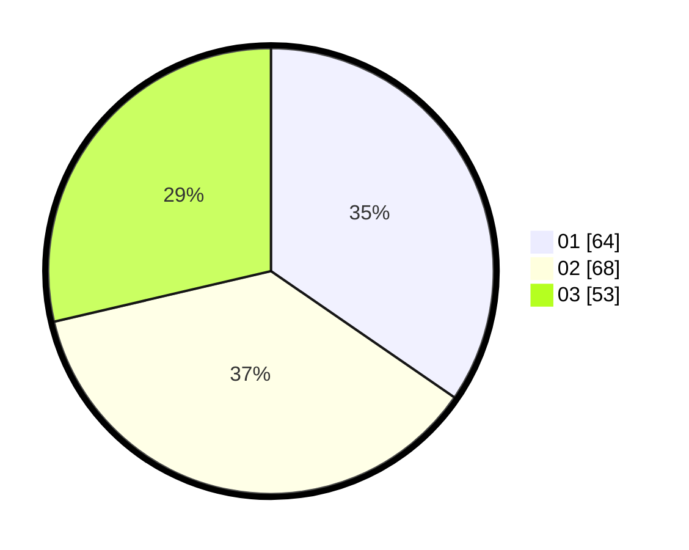

# Hasil

Hasil perolehan suara paslon dapat dilihat pada file paslon-01.txt, paslon-02.txt, dan paslon-03.txt.

Jika tidak ada, artinya data tersebut belum ada pada SIREKAP.

## Perolehan Suara

 * Paslon 01: **64**.
 * Paslon 02: **68**.
 * Paslon 03: **53**.

## Foto C Plano

https://sirekap-obj-formc.kpu.go.id/1616/pemilu/ppwp/31/73/04/10/02/3173041002082-20240214-185343--f0802081-70a2-4382-bea3-531eddc2951a.jpg

https://sirekap-obj-formc.kpu.go.id/1616/pemilu/ppwp/31/73/04/10/02/3173041002082-20240214-185457--6baff1c3-b8fd-4a9f-bd04-2556c3b88b0c.jpg
