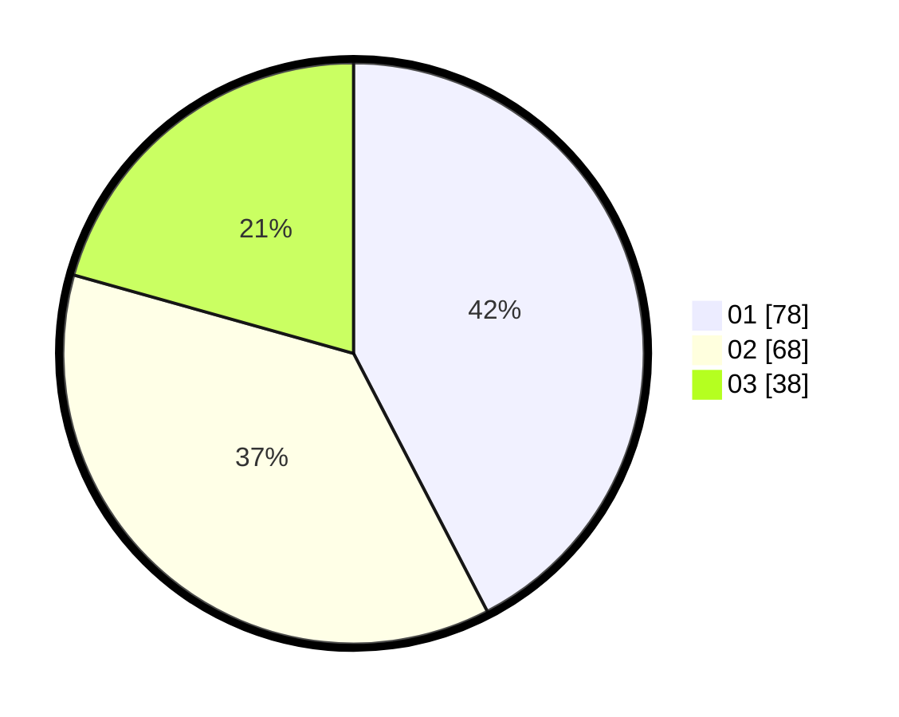

# Hasil

Hasil perolehan suara paslon dapat dilihat pada file paslon-01.txt, paslon-02.txt, dan paslon-03.txt.

Jika tidak ada, artinya data tersebut belum ada pada SIREKAP.

## Perolehan Suara

 * Paslon 01: **78**.
 * Paslon 02: **68**.
 * Paslon 03: **38**.

## Foto C Plano

https://sirekap-obj-formc.kpu.go.id/db48/pemilu/ppwp/31/73/04/10/02/3173041002083-20240216-005515--ecf8053c-1a19-43c2-8b6d-944ed212b9f3.jpg

https://sirekap-obj-formc.kpu.go.id/db48/pemilu/ppwp/31/73/04/10/02/3173041002083-20240216-005521--f412ece6-cfb6-4b37-9b1e-ac12956280de.jpg

https://sirekap-obj-formc.kpu.go.id/db48/pemilu/ppwp/31/73/04/10/02/3173041002083-20240216-005516--5fa67338-71f5-4043-bb1f-bdb4fa3fd625.jpg

## DATA PEMILIH TETAP

Jumlah pemilih dalam DPT: **262**.
 * L: **139**.
 * P: **123**.

## DATA PENGGUNA HAK PILIH

Jumlah pengguna hak pilih dalam DPT: **182**.
 * L: **95**.
 * P: **87**.

Jumlah pengguna hak pilih dalam DPTb: **0**.
 * L: **0**.
 * P: **0**.

Jumlah pengguna hak pilih dalam DPK: **2**.
 * L: **2**.
 * P: **0**.

Jumlah pengguna hak pilih: **184**.
 * L: **97**.
 * P: **87**.

## JUMLAH SUARA SAH DAN TIDAK SAH

JUMLAH SELURUH SUARA SAH: **184**.

JUMLAH SUARA TIDAK SAH: **0**.

JUMLAH SELURUH SUARA SAH DAN SUARA TIDAK SAH: **184**.
