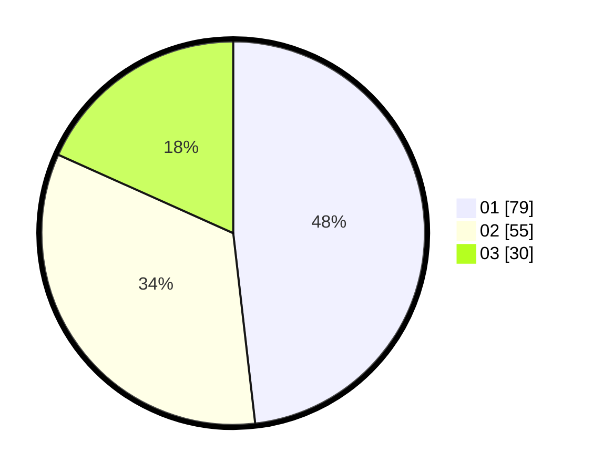

# Hasil

Hasil perolehan suara paslon dapat dilihat pada file paslon-01.txt, paslon-02.txt, dan paslon-03.txt.

Jika tidak ada, artinya data tersebut belum ada pada SIREKAP.

## Perolehan Suara

 * Paslon 01: **79**.
 * Paslon 02: **55**.
 * Paslon 03: **30**.

## Foto C Plano

https://sirekap-obj-formc.kpu.go.id/761d/pemilu/ppwp/31/73/04/10/02/3173041002084-20240214-155157--39eafb35-67da-4fb0-b02d-9b432cd6e629.jpg

https://sirekap-obj-formc.kpu.go.id/761d/pemilu/ppwp/31/73/04/10/02/3173041002084-20240214-203400--ddf6ad66-a36b-4fa7-be76-63af82d63c7e.jpg
