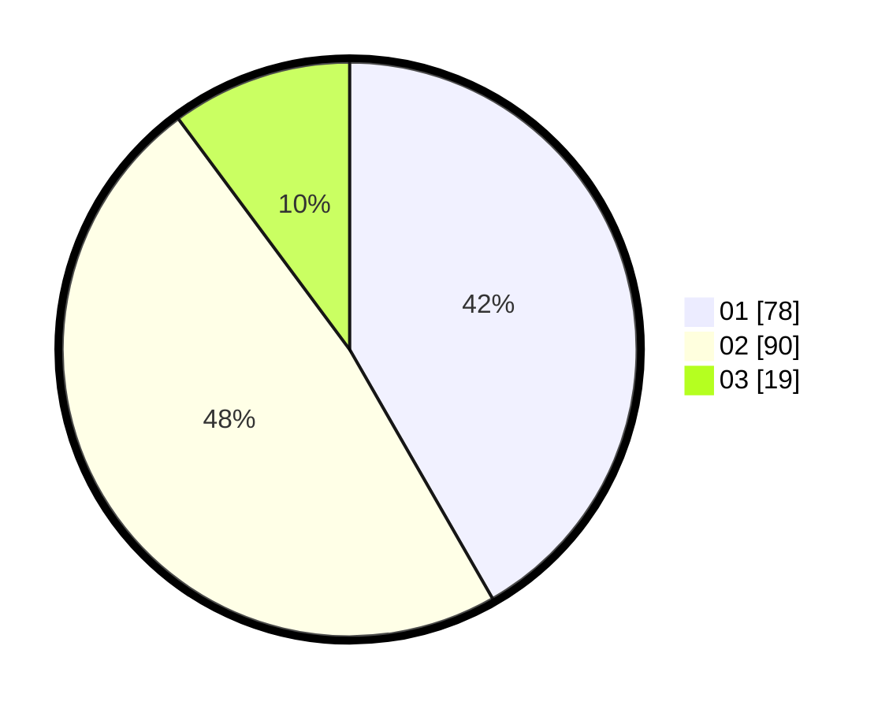

# Hasil

Hasil perolehan suara paslon dapat dilihat pada file paslon-01.txt, paslon-02.txt, dan paslon-03.txt.

Jika tidak ada, artinya data tersebut belum ada pada SIREKAP.

## Perolehan Suara

 * Paslon 01: **78**.
 * Paslon 02: **90**.
 * Paslon 03: **19**.

## Foto C Plano

https://sirekap-obj-formc.kpu.go.id/7ec9/pemilu/ppwp/31/73/04/10/03/3173041003005-20240214-191045--d9ad7f75-7979-4142-a7b3-2b7d75caceb1.jpg

https://sirekap-obj-formc.kpu.go.id/7ec9/pemilu/ppwp/31/73/04/10/03/3173041003005-20240214-190546--2ee5081f-12a0-4137-beb1-15c6b43f8847.jpg

https://sirekap-obj-formc.kpu.go.id/7ec9/pemilu/ppwp/31/73/04/10/03/3173041003005-20240214-192837--e7fbcaab-c2bf-4681-9589-7be2cb122bfb.jpg

## DATA PEMILIH TETAP

Jumlah pemilih dalam DPT: **262**.
 * L: **142**.
 * P: **120**.

## DATA PENGGUNA HAK PILIH

Jumlah pengguna hak pilih dalam DPT: **194**.
 * L: **103**.
 * P: **91**.

Jumlah pengguna hak pilih dalam DPTb: **0**.
 * L: **0**.
 * P: **0**.

Jumlah pengguna hak pilih dalam DPK: **0**.
 * L: **0**.
 * P: **0**.

Jumlah pengguna hak pilih: **194**.
 * L: **103**.
 * P: **91**.

## JUMLAH SUARA SAH DAN TIDAK SAH

JUMLAH SELURUH SUARA SAH: **187**.

JUMLAH SUARA TIDAK SAH: **7**.

JUMLAH SELURUH SUARA SAH DAN SUARA TIDAK SAH: **194**.
