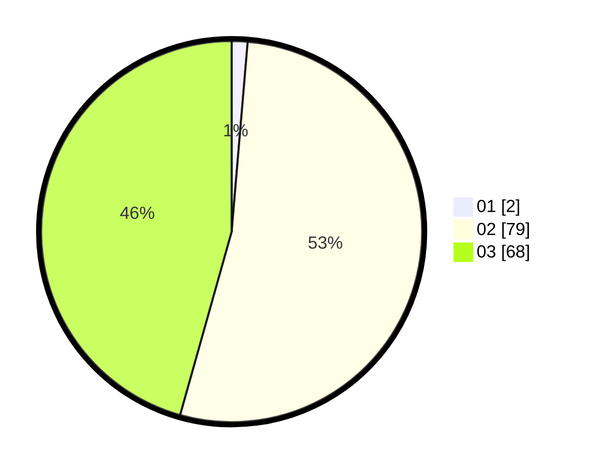

# Hasil

Hasil perolehan suara paslon dapat dilihat pada file paslon-01.txt, paslon-02.txt, dan paslon-03.txt.

Jika tidak ada, artinya data tersebut belum ada pada SIREKAP.

## Perolehan Suara

 * Paslon 01: **2**.
 * Paslon 02: **79**.
 * Paslon 03: **68**.

## Foto C Plano

https://sirekap-obj-formc.kpu.go.id/94a8/pemilu/ppwp/31/73/04/10/03/3173041003009-20240214-231106--760195eb-fff7-4ff6-8a54-6c17c9655c5f.jpg

https://sirekap-obj-formc.kpu.go.id/94a8/pemilu/ppwp/31/73/04/10/03/3173041003009-20240214-231230--36475f0b-2a2b-4218-8098-e07c9262b70a.jpg

https://sirekap-obj-formc.kpu.go.id/94a8/pemilu/ppwp/31/73/04/10/03/3173041003009-20240214-231323--e39ddc71-bf8e-4df7-b515-44e7c7f09db5.jpg
