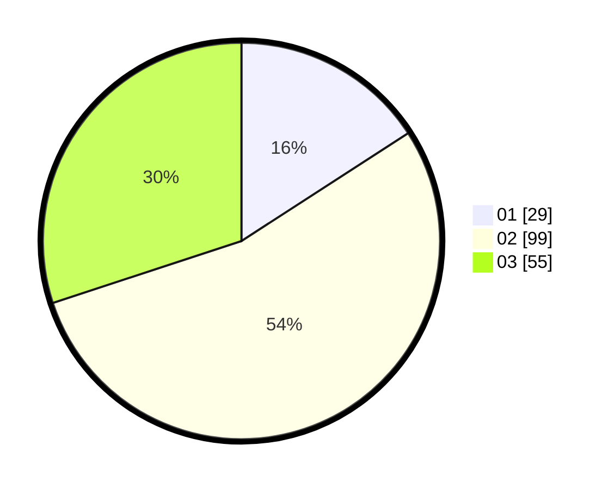

# Hasil

Hasil perolehan suara paslon dapat dilihat pada file paslon-01.txt, paslon-02.txt, dan paslon-03.txt.

Jika tidak ada, artinya data tersebut belum ada pada SIREKAP.

## Perolehan Suara

 * Paslon 01: **29**.
 * Paslon 02: **99**.
 * Paslon 03: **55**.

## Foto C Plano

https://sirekap-obj-formc.kpu.go.id/e220/pemilu/ppwp/31/73/04/10/03/3173041003011-20240214-155536--2ecc00e8-f5e3-495c-b7cc-6e66b207ed9e.jpg

https://sirekap-obj-formc.kpu.go.id/e220/pemilu/ppwp/31/73/04/10/03/3173041003011-20240216-142017--932597f7-d054-4e77-ac05-0cd307d59493.jpg

https://sirekap-obj-formc.kpu.go.id/e220/pemilu/ppwp/31/73/04/10/03/3173041003011-20240216-142029--fc864542-8b9e-4178-8c6f-5502cb49fc16.jpg
