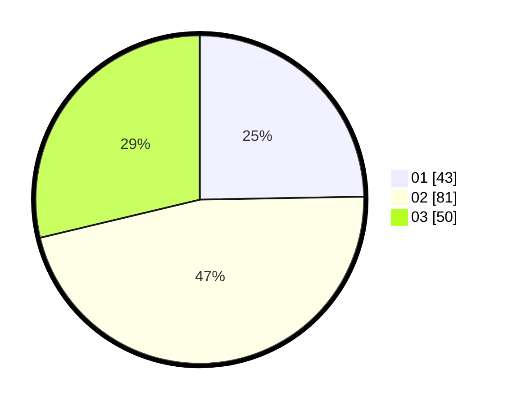

# Hasil

Hasil perolehan suara paslon dapat dilihat pada file paslon-01.txt, paslon-02.txt, dan paslon-03.txt.

Jika tidak ada, artinya data tersebut belum ada pada SIREKAP.

## Perolehan Suara

 * Paslon 01: **43**.
 * Paslon 02: **81**.
 * Paslon 03: **50**.

## Foto C Plano

https://sirekap-obj-formc.kpu.go.id/ce79/pemilu/ppwp/31/73/04/10/03/3173041003013-20240214-213839--45a8f522-a25f-4d75-b654-2f24073e2532.jpg

https://sirekap-obj-formc.kpu.go.id/ce79/pemilu/ppwp/31/73/04/10/03/3173041003013-20240214-213945--8a325790-8454-456a-ab2b-d867940cc9d5.jpg

https://sirekap-obj-formc.kpu.go.id/ce79/pemilu/ppwp/31/73/04/10/03/3173041003013-20240214-214037--1aee3ebf-c45c-4ee9-a602-6757e39a02a6.jpg
