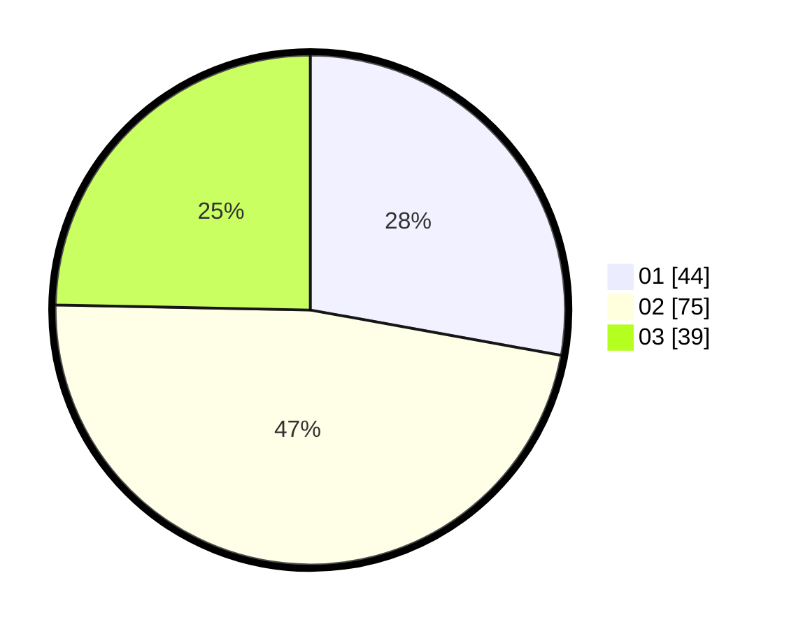

# Hasil

Hasil perolehan suara paslon dapat dilihat pada file paslon-01.txt, paslon-02.txt, dan paslon-03.txt.

Jika tidak ada, artinya data tersebut belum ada pada SIREKAP.

## Perolehan Suara

 * Paslon 01: **44**.
 * Paslon 02: **75**.
 * Paslon 03: **39**.

## Foto C Plano

https://sirekap-obj-formc.kpu.go.id/7b1b/pemilu/ppwp/31/73/04/10/03/3173041003015-20240216-060118--c4850a8e-1b38-4285-b5aa-da08214773e0.jpg

https://sirekap-obj-formc.kpu.go.id/7b1b/pemilu/ppwp/31/73/04/10/03/3173041003015-20240216-060120--ef32349b-7fed-46b9-977c-36e916f26740.jpg

https://sirekap-obj-formc.kpu.go.id/7b1b/pemilu/ppwp/31/73/04/10/03/3173041003015-20240216-060119--171cf182-03ea-4877-b9b4-6a0704a0e1ff.jpg

## DATA PEMILIH TETAP

Jumlah pemilih dalam DPT: **241**.
 * L: **128**.
 * P: **113**.

## DATA PENGGUNA HAK PILIH

Jumlah pengguna hak pilih dalam DPT: **163**.
 * L: **81**.
 * P: **82**.

Jumlah pengguna hak pilih dalam DPTb: **0**.
 * L: **0**.
 * P: **0**.

Jumlah pengguna hak pilih dalam DPK: **0**.
 * L: **0**.
 * P: **0**.

Jumlah pengguna hak pilih: **163**.
 * L: **81**.
 * P: **82**.

## JUMLAH SUARA SAH DAN TIDAK SAH

JUMLAH SELURUH SUARA SAH: **158**.

JUMLAH SUARA TIDAK SAH: **5**.

JUMLAH SELURUH SUARA SAH DAN SUARA TIDAK SAH: **163**.
