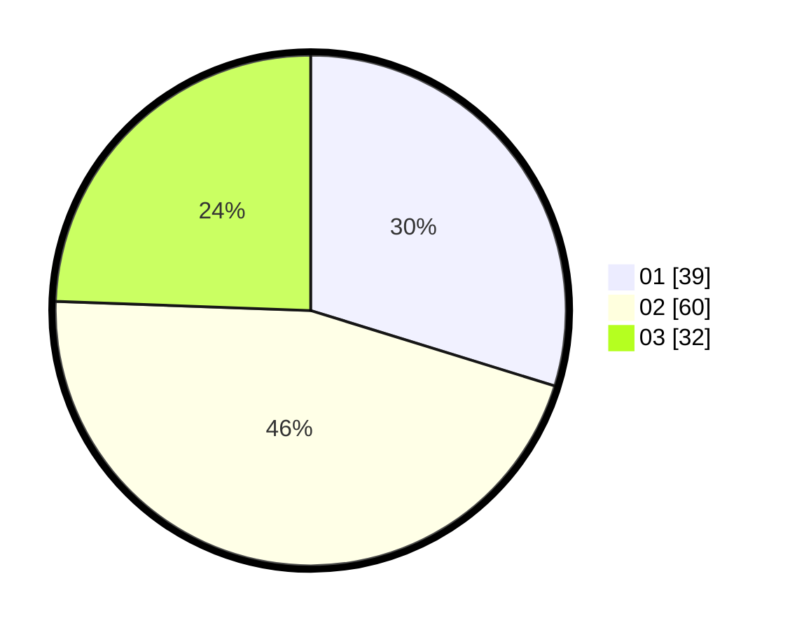

# Hasil

Hasil perolehan suara paslon dapat dilihat pada file paslon-01.txt, paslon-02.txt, dan paslon-03.txt.

Jika tidak ada, artinya data tersebut belum ada pada SIREKAP.

## Perolehan Suara

 * Paslon 01: **39**.
 * Paslon 02: **60**.
 * Paslon 03: **32**.

## Foto C Plano

https://sirekap-obj-formc.kpu.go.id/7aeb/pemilu/ppwp/31/73/04/10/03/3173041003021-20240214-190634--2f23b0c9-d0b3-45d7-ab57-968e7ee432dc.jpg

https://sirekap-obj-formc.kpu.go.id/7aeb/pemilu/ppwp/31/73/04/10/03/3173041003021-20240214-191418--79983c64-37cc-4c0f-958a-f1ed9490cb05.jpg

https://sirekap-obj-formc.kpu.go.id/7aeb/pemilu/ppwp/31/73/04/10/03/3173041003021-20240214-190353--925758db-cb25-4d03-9e64-a5cf72efda04.jpg
