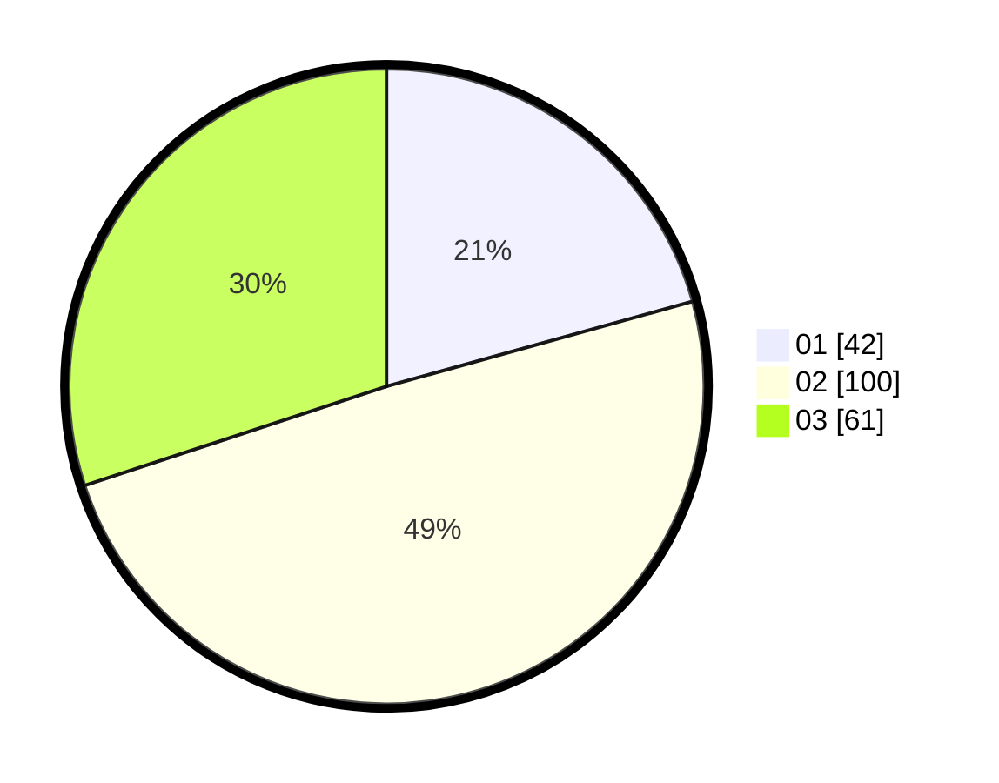

# Hasil

Hasil perolehan suara paslon dapat dilihat pada file paslon-01.txt, paslon-02.txt, dan paslon-03.txt.

Jika tidak ada, artinya data tersebut belum ada pada SIREKAP.

## Perolehan Suara

 * Paslon 01: **42**.
 * Paslon 02: **100**.
 * Paslon 03: **61**.

## Foto C Plano

https://sirekap-obj-formc.kpu.go.id/930a/pemilu/ppwp/31/73/04/10/03/3173041003023-20240214-213231--99fda12e-c1a0-4bd9-b42e-87000ba419bf.jpg

https://sirekap-obj-formc.kpu.go.id/930a/pemilu/ppwp/31/73/04/10/03/3173041003023-20240214-214106--fa69ea21-c723-46e4-b26b-e53f9ffbea26.jpg

https://sirekap-obj-formc.kpu.go.id/930a/pemilu/ppwp/31/73/04/10/03/3173041003023-20240214-214207--1a74bb86-41e0-475f-ab4b-22acca0a6d9e.jpg
