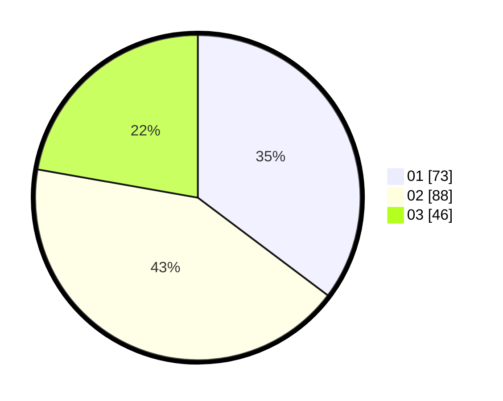

# Hasil

Hasil perolehan suara paslon dapat dilihat pada file paslon-01.txt, paslon-02.txt, dan paslon-03.txt.

Jika tidak ada, artinya data tersebut belum ada pada SIREKAP.

## Perolehan Suara

 * Paslon 01: **73**.
 * Paslon 02: **88**.
 * Paslon 03: **46**.

## Foto C Plano

https://sirekap-obj-formc.kpu.go.id/36d7/pemilu/ppwp/31/73/04/10/03/3173041003030-20240214-205459--b532b73e-4dbb-409a-aeaf-f55e9ebda8f2.jpg

https://sirekap-obj-formc.kpu.go.id/36d7/pemilu/ppwp/31/73/04/10/03/3173041003030-20240214-205550--62550bcd-f6c4-4f0e-a2bb-f2d570557e59.jpg

https://sirekap-obj-formc.kpu.go.id/36d7/pemilu/ppwp/31/73/04/10/03/3173041003030-20240214-205656--454b34c0-5748-439d-87dc-dea1902f2f2d.jpg
