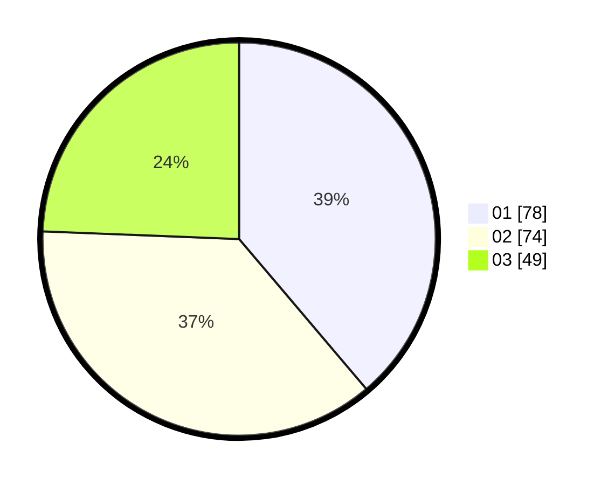

# Hasil

Hasil perolehan suara paslon dapat dilihat pada file paslon-01.txt, paslon-02.txt, dan paslon-03.txt.

Jika tidak ada, artinya data tersebut belum ada pada SIREKAP.

## Perolehan Suara

 * Paslon 01: **78**.
 * Paslon 02: **74**.
 * Paslon 03: **49**.

## Foto C Plano

https://sirekap-obj-formc.kpu.go.id/18b1/pemilu/ppwp/31/73/04/10/03/3173041003038-20240214-233359--e4dbb2c2-1bbb-487f-b5e6-c575a4261c56.jpg

https://sirekap-obj-formc.kpu.go.id/18b1/pemilu/ppwp/31/73/04/10/03/3173041003038-20240214-233524--7f60ec04-6807-4a33-bc32-1c3cba7ee568.jpg

https://sirekap-obj-formc.kpu.go.id/18b1/pemilu/ppwp/31/73/04/10/03/3173041003038-20240214-233633--033d6410-c026-498f-a92a-c86475bbb276.jpg
