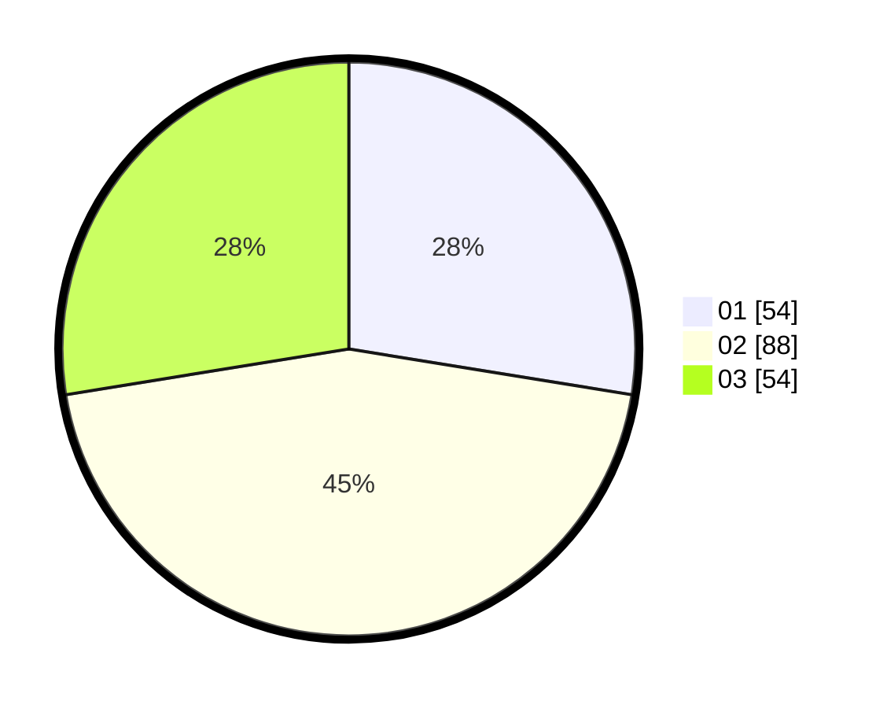

# Hasil

Hasil perolehan suara paslon dapat dilihat pada file paslon-01.txt, paslon-02.txt, dan paslon-03.txt.

Jika tidak ada, artinya data tersebut belum ada pada SIREKAP.

## Perolehan Suara

 * Paslon 01: **54**.
 * Paslon 02: **88**.
 * Paslon 03: **54**.

## Foto C Plano

https://sirekap-obj-formc.kpu.go.id/ac63/pemilu/ppwp/31/73/04/10/03/3173041003039-20240214-215718--78fb2aab-7fbd-406d-8d82-ac301b000f4e.jpg

https://sirekap-obj-formc.kpu.go.id/ac63/pemilu/ppwp/31/73/04/10/03/3173041003039-20240214-204615--d0e18941-5264-4716-9246-55572d65b264.jpg

https://sirekap-obj-formc.kpu.go.id/ac63/pemilu/ppwp/31/73/04/10/03/3173041003039-20240214-204648--60baec41-b0ab-456e-b0fe-5d9725b4bc93.jpg
