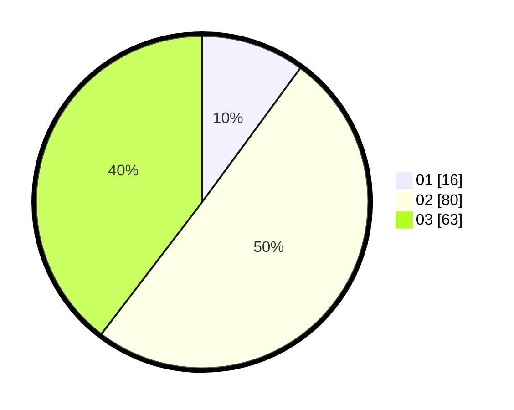

# Hasil

Hasil perolehan suara paslon dapat dilihat pada file paslon-01.txt, paslon-02.txt, dan paslon-03.txt.

Jika tidak ada, artinya data tersebut belum ada pada SIREKAP.

## Perolehan Suara

 * Paslon 01: **16**.
 * Paslon 02: **80**.
 * Paslon 03: **63**.

## Foto C Plano

https://sirekap-obj-formc.kpu.go.id/2081/pemilu/ppwp/31/73/04/10/03/3173041003045-20240214-204215--71c95539-eaa9-4008-aab4-4f68c038446f.jpg

https://sirekap-obj-formc.kpu.go.id/2081/pemilu/ppwp/31/73/04/10/03/3173041003045-20240214-200557--afc87b06-cf2b-4225-a253-2a444c027d60.jpg

https://sirekap-obj-formc.kpu.go.id/2081/pemilu/ppwp/31/73/04/10/03/3173041003045-20240214-200411--53a7974f-adae-404d-9cf4-c6202bd2fcc6.jpg
