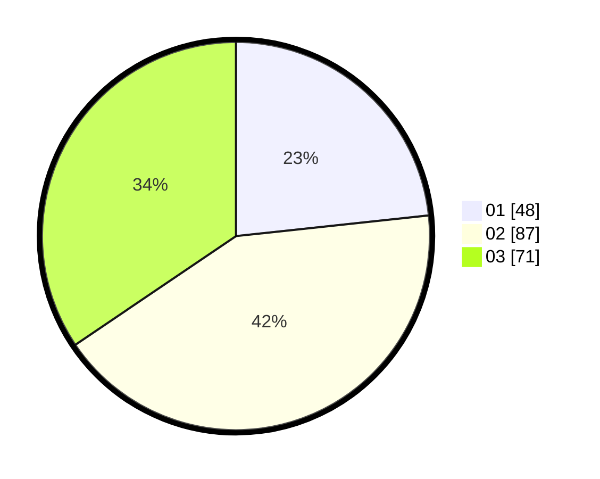

# Hasil

Hasil perolehan suara paslon dapat dilihat pada file paslon-01.txt, paslon-02.txt, dan paslon-03.txt.

Jika tidak ada, artinya data tersebut belum ada pada SIREKAP.

## Perolehan Suara

 * Paslon 01: **48**.
 * Paslon 02: **87**.
 * Paslon 03: **71**.

## Foto C Plano

https://sirekap-obj-formc.kpu.go.id/c2d1/pemilu/ppwp/31/73/04/10/03/3173041003049-20240214-221913--1b644886-d4c3-44c6-ac04-a4004c875844.jpg

https://sirekap-obj-formc.kpu.go.id/c2d1/pemilu/ppwp/31/73/04/10/03/3173041003049-20240214-212324--b653daa9-2149-4c17-9dea-9faedc8c7680.jpg

https://sirekap-obj-formc.kpu.go.id/c2d1/pemilu/ppwp/31/73/04/10/03/3173041003049-20240214-212425--4a31a85c-daf8-474a-885c-18e2c6257ba5.jpg
