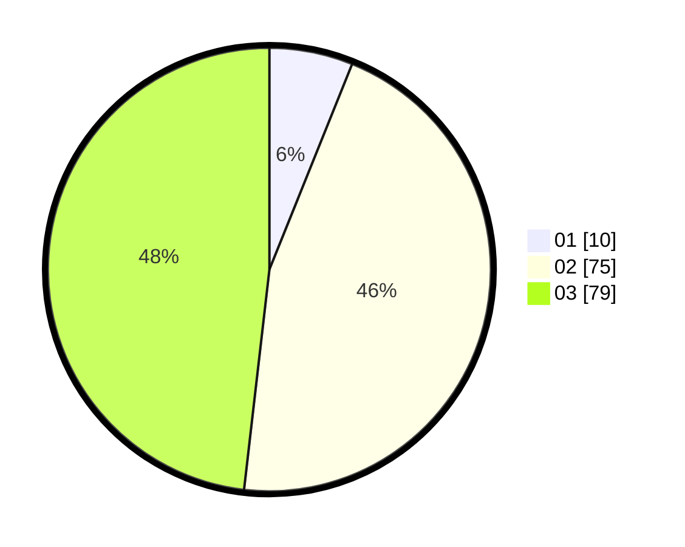

# Hasil

Hasil perolehan suara paslon dapat dilihat pada file paslon-01.txt, paslon-02.txt, dan paslon-03.txt.

Jika tidak ada, artinya data tersebut belum ada pada SIREKAP.

## Perolehan Suara

 * Paslon 01: **10**.
 * Paslon 02: **75**.
 * Paslon 03: **79**.

## Foto C Plano

https://sirekap-obj-formc.kpu.go.id/a7e6/pemilu/ppwp/31/73/04/10/03/3173041003056-20240214-233942--9fa8e1ab-1e98-478b-bf79-6a9630db666b.jpg

https://sirekap-obj-formc.kpu.go.id/a7e6/pemilu/ppwp/31/73/04/10/03/3173041003056-20240214-234019--74a6752e-9a6c-470a-974d-13fba18e7d70.jpg

https://sirekap-obj-formc.kpu.go.id/a7e6/pemilu/ppwp/31/73/04/10/03/3173041003056-20240214-234118--c0a41520-354c-46db-b22d-9456ee676e28.jpg
