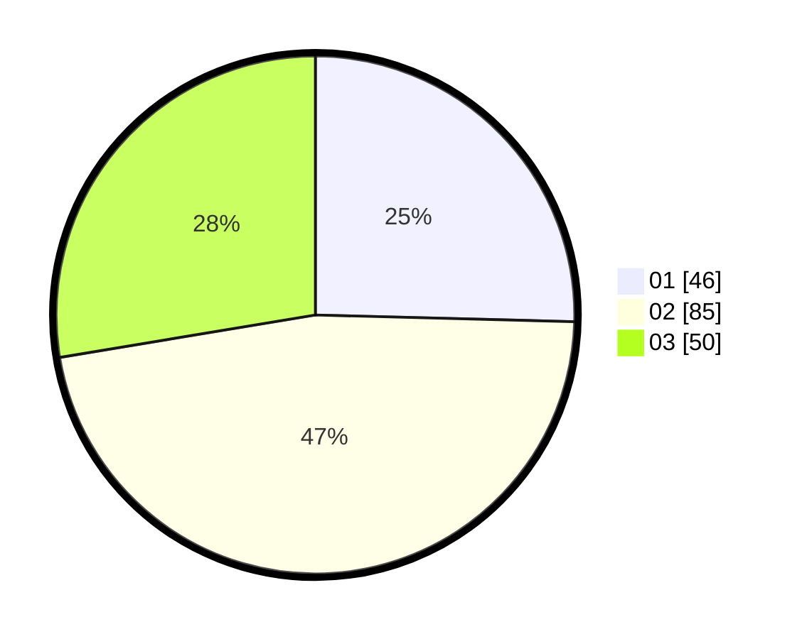

# Hasil

Hasil perolehan suara paslon dapat dilihat pada file paslon-01.txt, paslon-02.txt, dan paslon-03.txt.

Jika tidak ada, artinya data tersebut belum ada pada SIREKAP.

## Perolehan Suara

 * Paslon 01: **46**.
 * Paslon 02: **85**.
 * Paslon 03: **50**.

## Foto C Plano

https://sirekap-obj-formc.kpu.go.id/4c9d/pemilu/ppwp/31/73/04/10/03/3173041003057-20240215-024353--3dc939fa-89b0-4ce6-9250-f42e337ed23f.jpg

https://sirekap-obj-formc.kpu.go.id/4c9d/pemilu/ppwp/31/73/04/10/03/3173041003057-20240215-024430--7c27a460-49d9-4f77-a832-514aec89d0db.jpg

https://sirekap-obj-formc.kpu.go.id/4c9d/pemilu/ppwp/31/73/04/10/03/3173041003057-20240215-024514--d87aec87-5819-4948-823a-e73a57cd1ad7.jpg
