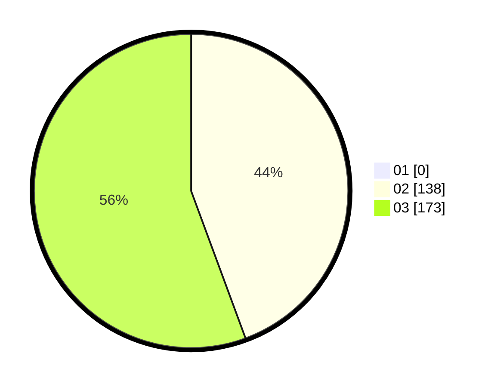

# Hasil

Hasil perolehan suara paslon dapat dilihat pada file paslon-01.txt, paslon-02.txt, dan paslon-03.txt.

Jika tidak ada, artinya data tersebut belum ada pada SIREKAP.

## Perolehan Suara

 * Paslon 01: **0**.
 * Paslon 02: **138**.
 * Paslon 03: **173**.

## Foto C Plano

https://sirekap-obj-formc.kpu.go.id/b9cb/pemilu/ppwp/31/73/04/10/03/3173041003067-20240214-232235--66508661-fc8e-4547-9e26-4b93bd545ddc.jpg

https://sirekap-obj-formc.kpu.go.id/b9cb/pemilu/ppwp/31/73/04/10/03/3173041003067-20240214-231607--6c3d3ed2-a63e-4d2a-b1ba-27c11e47d2d8.jpg

https://sirekap-obj-formc.kpu.go.id/b9cb/pemilu/ppwp/31/73/04/10/03/3173041003067-20240214-231707--dc53a9e7-e49d-4f75-bca9-8ef77d7f27db.jpg
