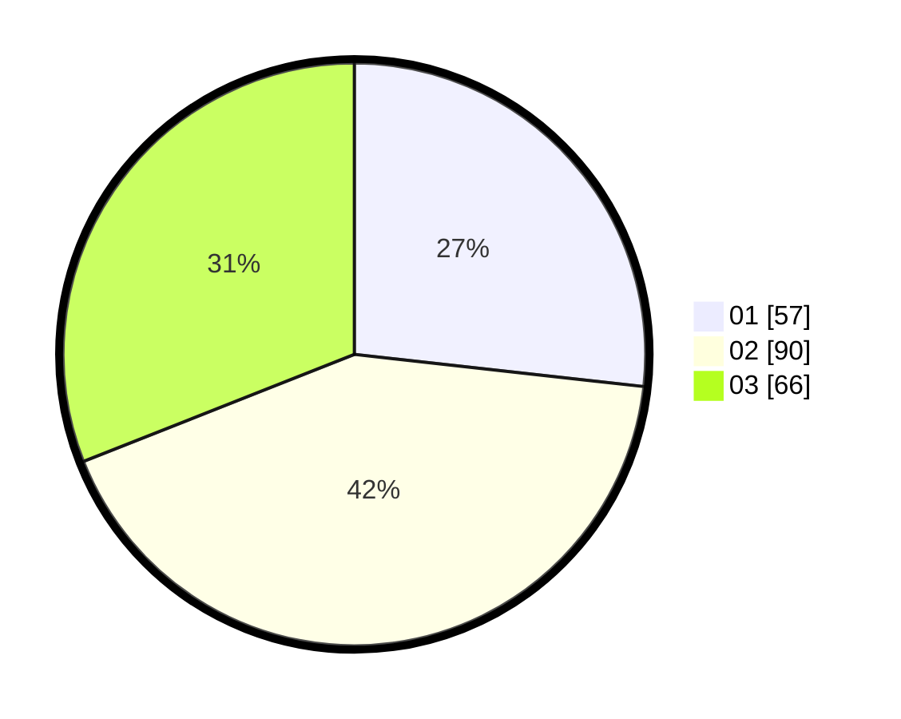

# Hasil

Hasil perolehan suara paslon dapat dilihat pada file paslon-01.txt, paslon-02.txt, dan paslon-03.txt.

Jika tidak ada, artinya data tersebut belum ada pada SIREKAP.

## Perolehan Suara

 * Paslon 01: **57**.
 * Paslon 02: **90**.
 * Paslon 03: **66**.

## Foto C Plano

https://sirekap-obj-formc.kpu.go.id/ec4a/pemilu/ppwp/31/73/04/10/04/3173041004005-20240217-210018--084c2c80-d0fe-49da-9945-ec2f3b1020fb.jpg

https://sirekap-obj-formc.kpu.go.id/ec4a/pemilu/ppwp/31/73/04/10/04/3173041004005-20240214-200327--16e824c2-d425-4eec-9700-27b927b1b14e.jpg

https://sirekap-obj-formc.kpu.go.id/ec4a/pemilu/ppwp/31/73/04/10/04/3173041004005-20240214-191206--458b65eb-3e7b-4f4f-b44c-a8233f7e4e03.jpg
