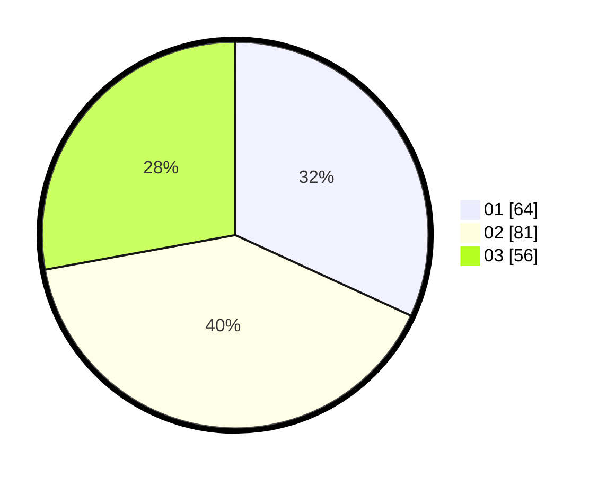

# Hasil

Hasil perolehan suara paslon dapat dilihat pada file paslon-01.txt, paslon-02.txt, dan paslon-03.txt.

Jika tidak ada, artinya data tersebut belum ada pada SIREKAP.

## Perolehan Suara

 * Paslon 01: **64**.
 * Paslon 02: **81**.
 * Paslon 03: **56**.

## Foto C Plano

https://sirekap-obj-formc.kpu.go.id/afe2/pemilu/ppwp/31/73/04/10/04/3173041004008-20240215-010016--a9c2b50f-3fc2-418a-bb7a-e5d61aef256d.jpg

https://sirekap-obj-formc.kpu.go.id/afe2/pemilu/ppwp/31/73/04/10/04/3173041004008-20240215-010215--82c8c4b1-4951-4b8b-9b96-98b46281635d.jpg

https://sirekap-obj-formc.kpu.go.id/afe2/pemilu/ppwp/31/73/04/10/04/3173041004008-20240215-010318--7d93c74f-e25b-4624-9f62-97c15d8e3b8a.jpg
