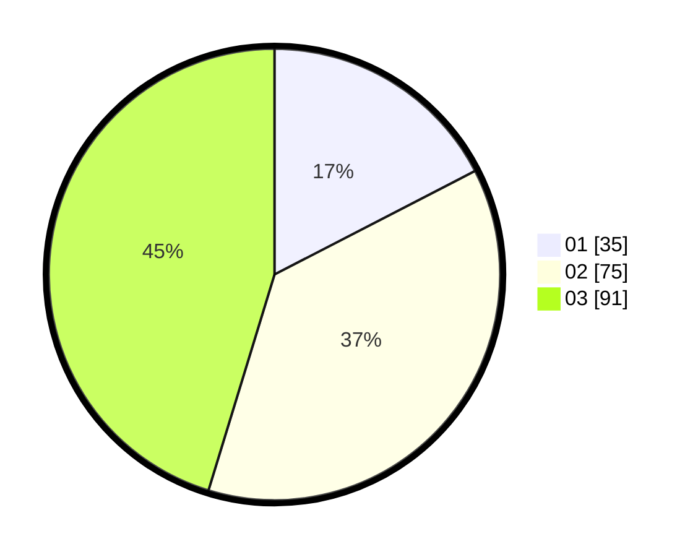

# Hasil

Hasil perolehan suara paslon dapat dilihat pada file paslon-01.txt, paslon-02.txt, dan paslon-03.txt.

Jika tidak ada, artinya data tersebut belum ada pada SIREKAP.

## Perolehan Suara

 * Paslon 01: **35**.
 * Paslon 02: **75**.
 * Paslon 03: **91**.

## Foto C Plano

https://sirekap-obj-formc.kpu.go.id/0a3d/pemilu/ppwp/31/73/04/10/04/3173041004009-20240214-155535--f1a1bb7c-4fae-4f6e-be25-d07940466482.jpg

https://sirekap-obj-formc.kpu.go.id/0a3d/pemilu/ppwp/31/73/04/10/04/3173041004009-20240214-155726--5c84cf7d-c11b-41d2-a4e1-b15fc4de89ab.jpg

https://sirekap-obj-formc.kpu.go.id/0a3d/pemilu/ppwp/31/73/04/10/04/3173041004009-20240217-083003--fbbfb418-1fdf-4e6b-bdeb-317843a24076.jpg
