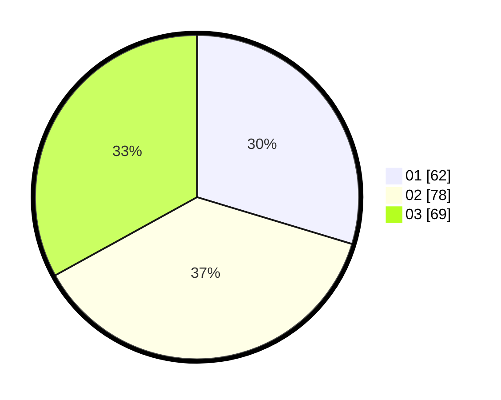

# Hasil

Hasil perolehan suara paslon dapat dilihat pada file paslon-01.txt, paslon-02.txt, dan paslon-03.txt.

Jika tidak ada, artinya data tersebut belum ada pada SIREKAP.

## Perolehan Suara

 * Paslon 01: **62**.
 * Paslon 02: **78**.
 * Paslon 03: **69**.

## Foto C Plano

https://sirekap-obj-formc.kpu.go.id/5245/pemilu/ppwp/31/73/04/10/04/3173041004012-20240214-203417--eb3432c4-4ae2-409a-9a60-dc1580c9e1a9.jpg

https://sirekap-obj-formc.kpu.go.id/5245/pemilu/ppwp/31/73/04/10/04/3173041004012-20240214-203525--c95724e6-24bd-470a-b9b4-5bbef68b5986.jpg

https://sirekap-obj-formc.kpu.go.id/5245/pemilu/ppwp/31/73/04/10/04/3173041004012-20240214-203710--20f29653-62e6-4547-aced-a18dd10d5125.jpg

## DATA PEMILIH TETAP

Jumlah pemilih dalam DPT: **275**.
 * L: **141**.
 * P: **134**.

## DATA PENGGUNA HAK PILIH

Jumlah pengguna hak pilih dalam DPT: **208**.
 * L: **107**.
 * P: **101**.

Jumlah pengguna hak pilih dalam DPTb: **2**.
 * L: **2**.
 * P: **0**.

Jumlah pengguna hak pilih dalam DPK: **0**.
 * L: **0**.
 * P: **0**.

Jumlah pengguna hak pilih: **210**.
 * L: **109**.
 * P: **101**.

## JUMLAH SUARA SAH DAN TIDAK SAH

JUMLAH SELURUH SUARA SAH: **209**.

JUMLAH SUARA TIDAK SAH: **1**.

JUMLAH SELURUH SUARA SAH DAN SUARA TIDAK SAH: **210**.
