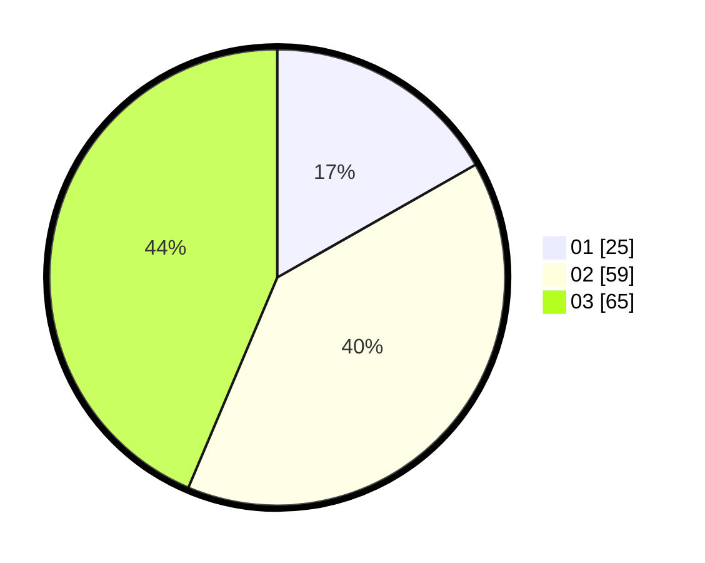

# Hasil

Hasil perolehan suara paslon dapat dilihat pada file paslon-01.txt, paslon-02.txt, dan paslon-03.txt.

Jika tidak ada, artinya data tersebut belum ada pada SIREKAP.

## Perolehan Suara

 * Paslon 01: **25**.
 * Paslon 02: **59**.
 * Paslon 03: **65**.

## Foto C Plano

https://sirekap-obj-formc.kpu.go.id/409d/pemilu/ppwp/31/73/04/10/04/3173041004013-20240218-132005--328f8240-9a91-4814-a54b-6ee6df18923a.jpg

https://sirekap-obj-formc.kpu.go.id/409d/pemilu/ppwp/31/73/04/10/04/3173041004013-20240218-132007--4a727990-d064-4638-a4d8-8a6e89025448.jpg

https://sirekap-obj-formc.kpu.go.id/409d/pemilu/ppwp/31/73/04/10/04/3173041004013-20240218-132006--dc35c6a9-32e9-46da-9f44-baf174b5fb05.jpg

## DATA PEMILIH TETAP

Jumlah pemilih dalam DPT: **185**.
 * L: **76**.
 * P: **109**.

## DATA PENGGUNA HAK PILIH

Jumlah pengguna hak pilih dalam DPT: **154**.
 * L: **63**.
 * P: **91**.

Jumlah pengguna hak pilih dalam DPTb: **0**.
 * L: **0**.
 * P: **0**.

Jumlah pengguna hak pilih dalam DPK: **0**.
 * L: **0**.
 * P: **0**.

Jumlah pengguna hak pilih: **154**.
 * L: **63**.
 * P: **91**.

## JUMLAH SUARA SAH DAN TIDAK SAH

JUMLAH SELURUH SUARA SAH: **149**.

JUMLAH SUARA TIDAK SAH: **5**.

JUMLAH SELURUH SUARA SAH DAN SUARA TIDAK SAH: **154**.
