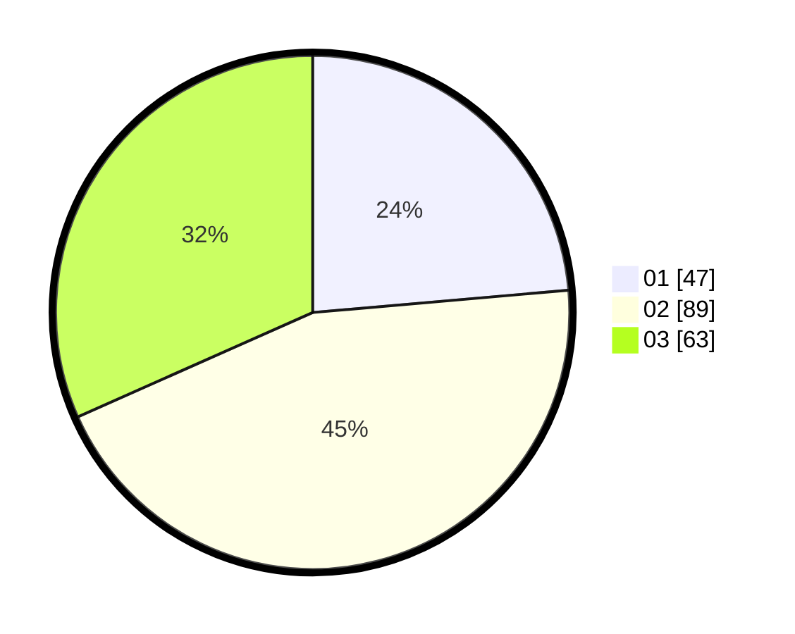

# Hasil

Hasil perolehan suara paslon dapat dilihat pada file paslon-01.txt, paslon-02.txt, dan paslon-03.txt.

Jika tidak ada, artinya data tersebut belum ada pada SIREKAP.

## Perolehan Suara

 * Paslon 01: **47**.
 * Paslon 02: **89**.
 * Paslon 03: **63**.

## Foto C Plano

https://sirekap-obj-formc.kpu.go.id/26a0/pemilu/ppwp/31/73/04/10/04/3173041004014-20240214-180336--d323386a-b1a2-486c-a0a1-860ca3a2f612.jpg

https://sirekap-obj-formc.kpu.go.id/26a0/pemilu/ppwp/31/73/04/10/04/3173041004014-20240214-193341--a0989b27-e0b6-44c5-bf86-d4f7bab8f1ec.jpg

https://sirekap-obj-formc.kpu.go.id/26a0/pemilu/ppwp/31/73/04/10/04/3173041004014-20240214-204112--c844a634-7612-45fd-94be-a613a4ee3257.jpg

## DATA PEMILIH TETAP

Jumlah pemilih dalam DPT: **203**.
 * L: **97**.
 * P: **106**.

## DATA PENGGUNA HAK PILIH

Jumlah pengguna hak pilih dalam DPT: **202**.
 * L: **97**.
 * P: **105**.

Jumlah pengguna hak pilih dalam DPTb: **0**.
 * L: **0**.
 * P: **0**.

Jumlah pengguna hak pilih dalam DPK: **1**.
 * L: **0**.
 * P: **1**.

Jumlah pengguna hak pilih: **203**.
 * L: **97**.
 * P: **106**.

## JUMLAH SUARA SAH DAN TIDAK SAH

JUMLAH SELURUH SUARA SAH: **199**.

JUMLAH SUARA TIDAK SAH: **4**.

JUMLAH SELURUH SUARA SAH DAN SUARA TIDAK SAH: **203**.
