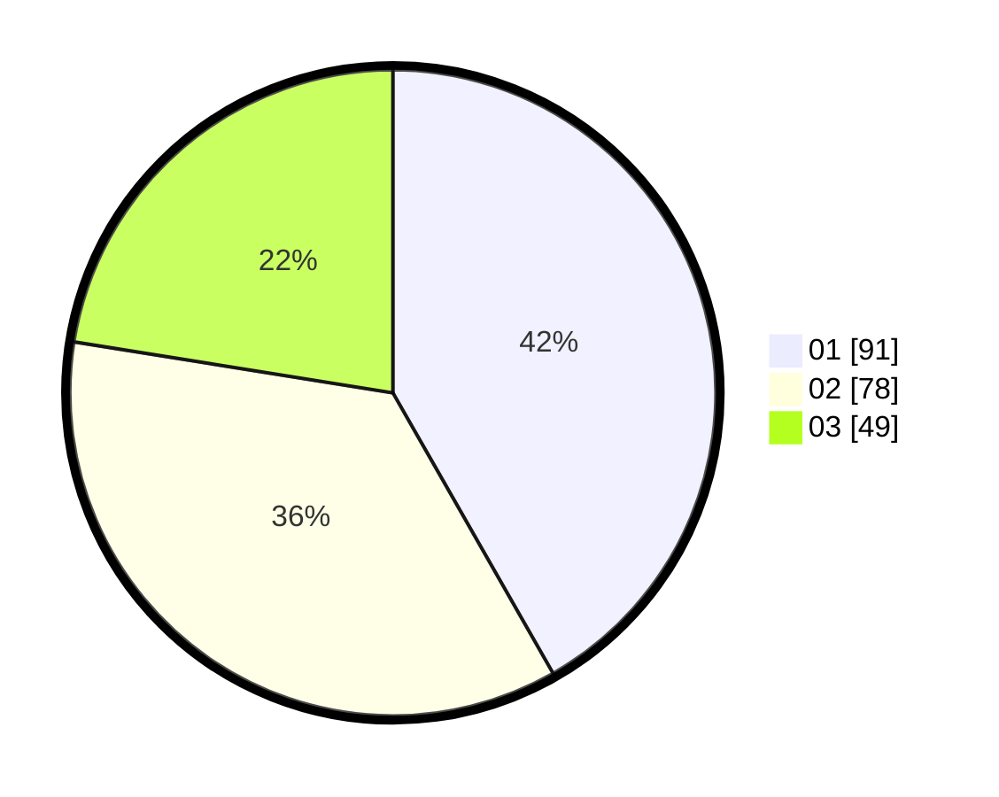

# Hasil

Hasil perolehan suara paslon dapat dilihat pada file paslon-01.txt, paslon-02.txt, dan paslon-03.txt.

Jika tidak ada, artinya data tersebut belum ada pada SIREKAP.

## Perolehan Suara

 * Paslon 01: **91**.
 * Paslon 02: **78**.
 * Paslon 03: **49**.

## Foto C Plano

https://sirekap-obj-formc.kpu.go.id/92ab/pemilu/ppwp/31/73/04/10/04/3173041004015-20240214-224955--8f478393-f94c-4fee-a1a6-343863f5df83.jpg

https://sirekap-obj-formc.kpu.go.id/92ab/pemilu/ppwp/31/73/04/10/04/3173041004015-20240217-155218--a8f76cb9-0a5d-4f44-878f-4aa920980f9a.jpg

https://sirekap-obj-formc.kpu.go.id/92ab/pemilu/ppwp/31/73/04/10/04/3173041004015-20240216-234341--68e2d437-0f4c-4761-be46-0d1acdf049d1.jpg
