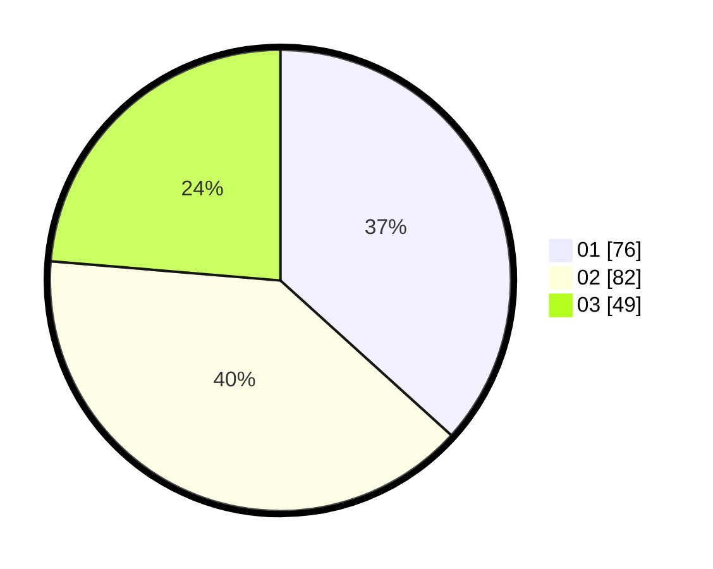

# Hasil

Hasil perolehan suara paslon dapat dilihat pada file paslon-01.txt, paslon-02.txt, dan paslon-03.txt.

Jika tidak ada, artinya data tersebut belum ada pada SIREKAP.

## Perolehan Suara

 * Paslon 01: **76**.
 * Paslon 02: **82**.
 * Paslon 03: **49**.

## Foto C Plano

https://sirekap-obj-formc.kpu.go.id/ea9d/pemilu/ppwp/31/73/04/10/04/3173041004016-20240214-211724--a84b1555-966d-4725-a528-907773bb95b3.jpg

https://sirekap-obj-formc.kpu.go.id/ea9d/pemilu/ppwp/31/73/04/10/04/3173041004016-20240214-232535--3e95a487-b3bc-4d8f-97c9-d1b138f9902e.jpg

https://sirekap-obj-formc.kpu.go.id/ea9d/pemilu/ppwp/31/73/04/10/04/3173041004016-20240214-212034--b627a7a3-b61c-490f-a2bf-8d138601a533.jpg

## DATA PEMILIH TETAP

Jumlah pemilih dalam DPT: **283**.
 * L: **147**.
 * P: **136**.

## DATA PENGGUNA HAK PILIH

Jumlah pengguna hak pilih dalam DPT: **209**.
 * L: **104**.
 * P: **105**.

Jumlah pengguna hak pilih dalam DPTb: **0**.
 * L: **0**.
 * P: **0**.

Jumlah pengguna hak pilih dalam DPK: **2**.
 * L: **2**.
 * P: **0**.

Jumlah pengguna hak pilih: **211**.
 * L: **106**.
 * P: **105**.

## JUMLAH SUARA SAH DAN TIDAK SAH

JUMLAH SELURUH SUARA SAH: **207**.

JUMLAH SUARA TIDAK SAH: **4**.

JUMLAH SELURUH SUARA SAH DAN SUARA TIDAK SAH: **211**.
