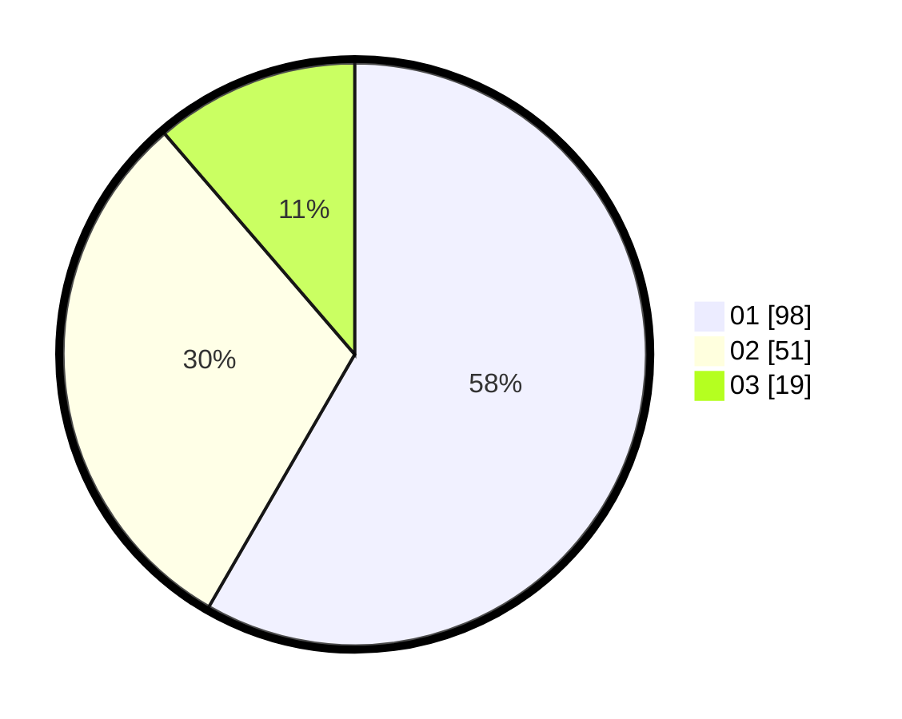

# Hasil

Hasil perolehan suara paslon dapat dilihat pada file paslon-01.txt, paslon-02.txt, dan paslon-03.txt.

Jika tidak ada, artinya data tersebut belum ada pada SIREKAP.

## Perolehan Suara

 * Paslon 01: **98**.
 * Paslon 02: **51**.
 * Paslon 03: **19**.

## Foto C Plano

https://sirekap-obj-formc.kpu.go.id/61fa/pemilu/ppwp/31/73/04/10/04/3173041004018-20240215-193538--cec9f842-7d25-4eef-b69a-697681f67e1d.jpg

https://sirekap-obj-formc.kpu.go.id/61fa/pemilu/ppwp/31/73/04/10/04/3173041004018-20240215-193543--c3a0758b-6bb0-4452-96c0-8c00859313c5.jpg

https://sirekap-obj-formc.kpu.go.id/61fa/pemilu/ppwp/31/73/04/10/04/3173041004018-20240215-193549--cbb1a24d-d284-4065-860e-4f86d6fdb962.jpg
