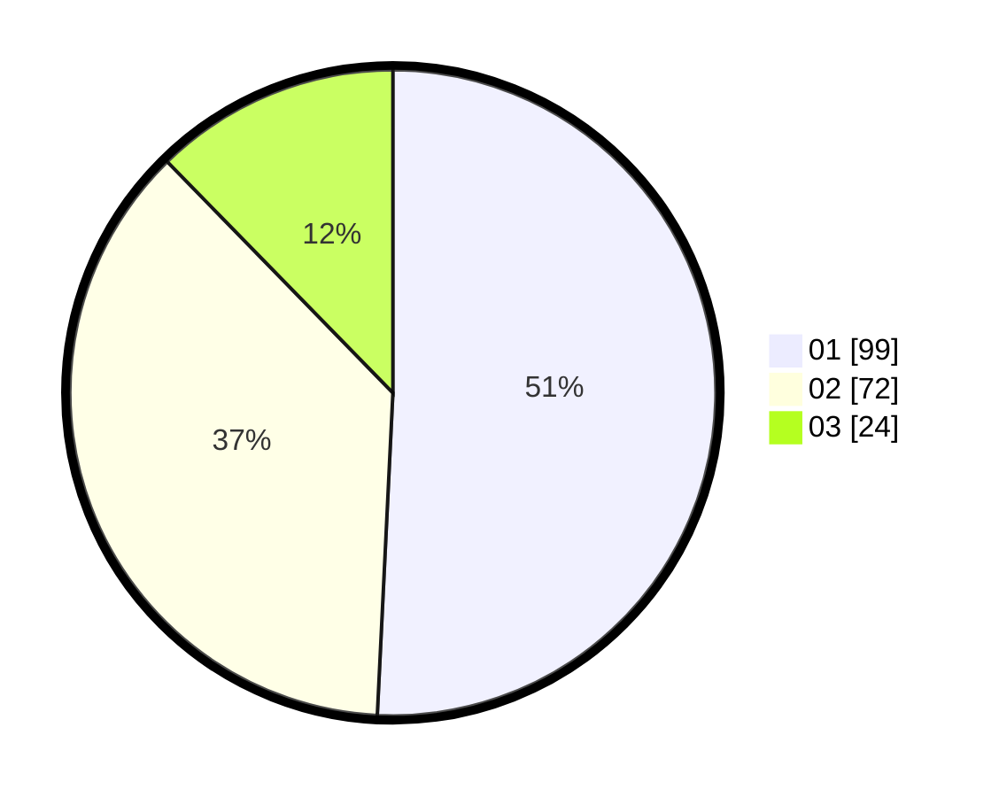

# Hasil

Hasil perolehan suara paslon dapat dilihat pada file paslon-01.txt, paslon-02.txt, dan paslon-03.txt.

Jika tidak ada, artinya data tersebut belum ada pada SIREKAP.

## Perolehan Suara

 * Paslon 01: **99**.
 * Paslon 02: **72**.
 * Paslon 03: **24**.

## Foto C Plano

https://sirekap-obj-formc.kpu.go.id/a184/pemilu/ppwp/31/73/04/10/04/3173041004021-20240214-160119--e0cbb6ff-d324-4a3a-ab2b-165ecf393afc.jpg

https://sirekap-obj-formc.kpu.go.id/a184/pemilu/ppwp/31/73/04/10/04/3173041004021-20240214-160129--9d5b7b40-48db-4450-b569-5e869a2ebd11.jpg

https://sirekap-obj-formc.kpu.go.id/a184/pemilu/ppwp/31/73/04/10/04/3173041004021-20240214-160138--9e676958-82ad-473a-b791-19d7d0ee6b3c.jpg

## DATA PEMILIH TETAP

Jumlah pemilih dalam DPT: **196**.
 * L: **97**.
 * P: **99**.

## DATA PENGGUNA HAK PILIH

Jumlah pengguna hak pilih dalam DPT: **196**.
 * L: **97**.
 * P: **99**.

Jumlah pengguna hak pilih dalam DPTb: **0**.
 * L: **0**.
 * P: **0**.

Jumlah pengguna hak pilih dalam DPK: **0**.
 * L: **0**.
 * P: **0**.

Jumlah pengguna hak pilih: **196**.
 * L: **97**.
 * P: **99**.

## JUMLAH SUARA SAH DAN TIDAK SAH

JUMLAH SELURUH SUARA SAH: **195**.

JUMLAH SUARA TIDAK SAH: **1**.

JUMLAH SELURUH SUARA SAH DAN SUARA TIDAK SAH: **196**.
