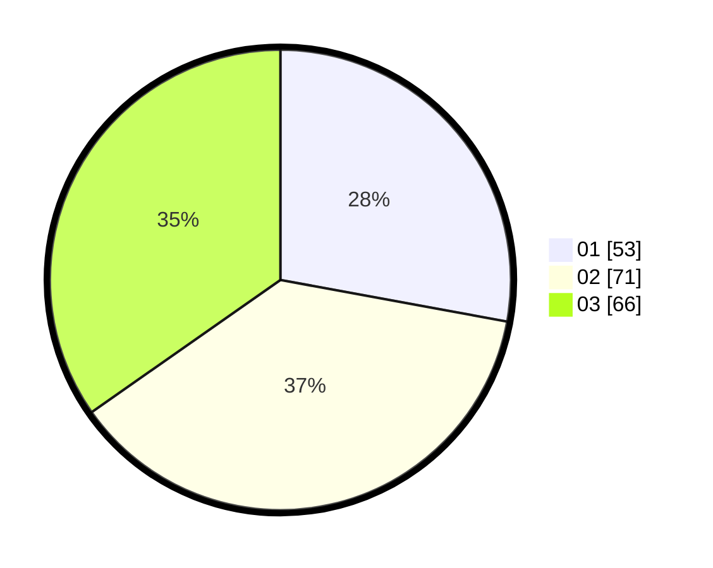

# Hasil

Hasil perolehan suara paslon dapat dilihat pada file paslon-01.txt, paslon-02.txt, dan paslon-03.txt.

Jika tidak ada, artinya data tersebut belum ada pada SIREKAP.

## Perolehan Suara

 * Paslon 01: **53**.
 * Paslon 02: **71**.
 * Paslon 03: **66**.

## Foto C Plano

https://sirekap-obj-formc.kpu.go.id/431a/pemilu/ppwp/31/73/04/10/04/3173041004024-20240214-212901--3c882b1f-93f9-4939-9289-ad60e4be1eb9.jpg

https://sirekap-obj-formc.kpu.go.id/431a/pemilu/ppwp/31/73/04/10/04/3173041004024-20240214-213221--d4ba7871-327d-425c-9ef0-aa51da960dc5.jpg

https://sirekap-obj-formc.kpu.go.id/431a/pemilu/ppwp/31/73/04/10/04/3173041004024-20240214-213324--1552fc6f-0249-441c-a867-996533fee1fb.jpg

## DATA PEMILIH TETAP

Jumlah pemilih dalam DPT: **281**.
 * L: **152**.
 * P: **129**.

## DATA PENGGUNA HAK PILIH

Jumlah pengguna hak pilih dalam DPT: **188**.
 * L: **103**.
 * P: **85**.

Jumlah pengguna hak pilih dalam DPTb: **0**.
 * L: **0**.
 * P: **0**.

Jumlah pengguna hak pilih dalam DPK: **3**.
 * L: **1**.
 * P: **2**.

Jumlah pengguna hak pilih: **191**.
 * L: **104**.
 * P: **87**.

## JUMLAH SUARA SAH DAN TIDAK SAH

JUMLAH SELURUH SUARA SAH: **190**.

JUMLAH SUARA TIDAK SAH: **1**.

JUMLAH SELURUH SUARA SAH DAN SUARA TIDAK SAH: **191**.
