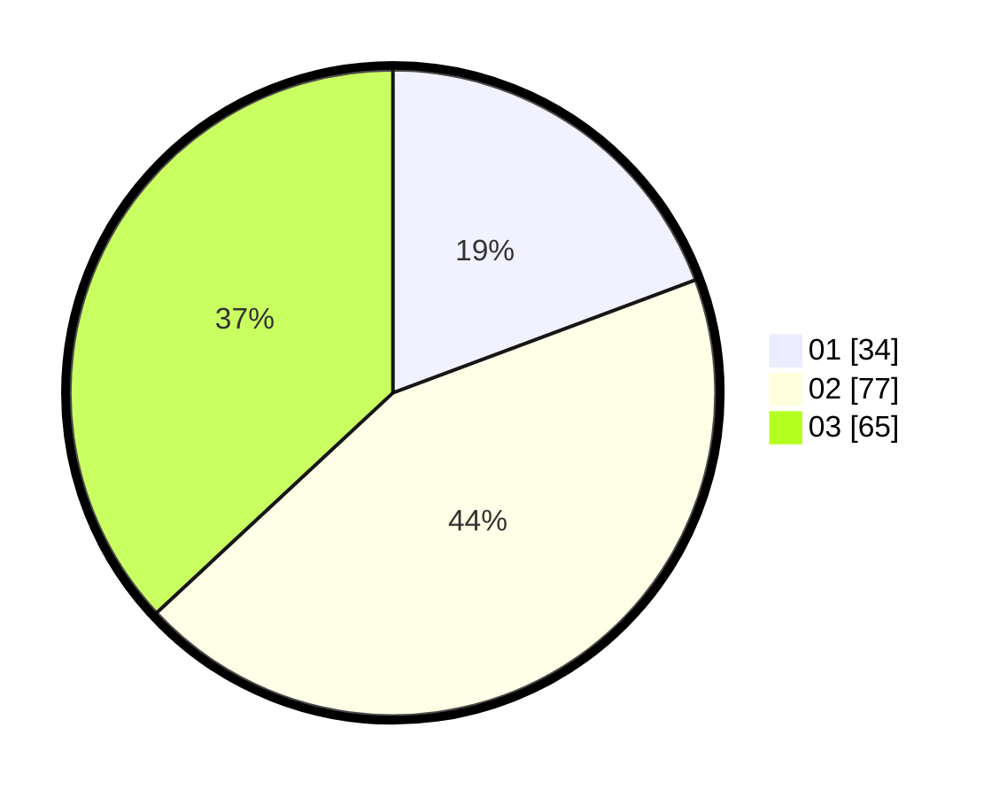

# Hasil

Hasil perolehan suara paslon dapat dilihat pada file paslon-01.txt, paslon-02.txt, dan paslon-03.txt.

Jika tidak ada, artinya data tersebut belum ada pada SIREKAP.

## Perolehan Suara

 * Paslon 01: **34**.
 * Paslon 02: **77**.
 * Paslon 03: **65**.

## Foto C Plano

https://sirekap-obj-formc.kpu.go.id/e8b0/pemilu/ppwp/31/73/04/10/04/3173041004025-20240214-155455--9e239b6e-2e01-4e0c-b356-a89447aa2521.jpg

https://sirekap-obj-formc.kpu.go.id/e8b0/pemilu/ppwp/31/73/04/10/04/3173041004025-20240214-155628--d7ec9b9a-f9b5-4551-8572-dff82db9cc32.jpg

https://sirekap-obj-formc.kpu.go.id/e8b0/pemilu/ppwp/31/73/04/10/04/3173041004025-20240214-155743--90e97fb0-54f0-415e-badb-ad5f4e394857.jpg

## DATA PEMILIH TETAP

Jumlah pemilih dalam DPT: **257**.
 * L: **130**.
 * P: **127**.

## DATA PENGGUNA HAK PILIH

Jumlah pengguna hak pilih dalam DPT: **177**.
 * L: **81**.
 * P: **96**.

Jumlah pengguna hak pilih dalam DPTb: **0**.
 * L: **0**.
 * P: **0**.

Jumlah pengguna hak pilih dalam DPK: **2**.
 * L: **1**.
 * P: **1**.

Jumlah pengguna hak pilih: **179**.
 * L: **82**.
 * P: **97**.

## JUMLAH SUARA SAH DAN TIDAK SAH

JUMLAH SELURUH SUARA SAH: **176**.

JUMLAH SUARA TIDAK SAH: **3**.

JUMLAH SELURUH SUARA SAH DAN SUARA TIDAK SAH: **179**.
