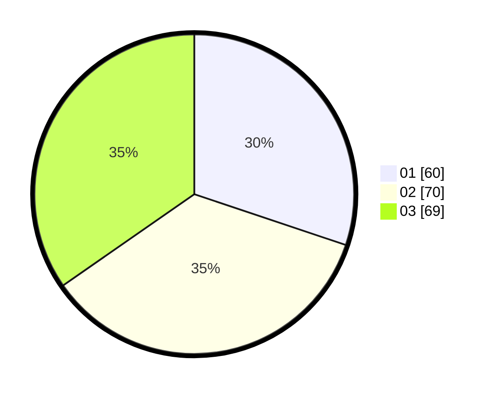

# Hasil

Hasil perolehan suara paslon dapat dilihat pada file paslon-01.txt, paslon-02.txt, dan paslon-03.txt.

Jika tidak ada, artinya data tersebut belum ada pada SIREKAP.

## Perolehan Suara

 * Paslon 01: **60**.
 * Paslon 02: **70**.
 * Paslon 03: **69**.

## Foto C Plano

https://sirekap-obj-formc.kpu.go.id/b327/pemilu/ppwp/31/73/04/10/04/3173041004026-20240214-211609--00163b76-2f8e-430f-b4cc-1550216989f8.jpg

https://sirekap-obj-formc.kpu.go.id/b327/pemilu/ppwp/31/73/04/10/04/3173041004026-20240214-222742--c075b686-99be-4ff7-bba2-3a6c70aa3bcc.jpg

https://sirekap-obj-formc.kpu.go.id/b327/pemilu/ppwp/31/73/04/10/04/3173041004026-20240214-211947--a43e2cf9-1da8-422b-aad6-c5f09093d67a.jpg
