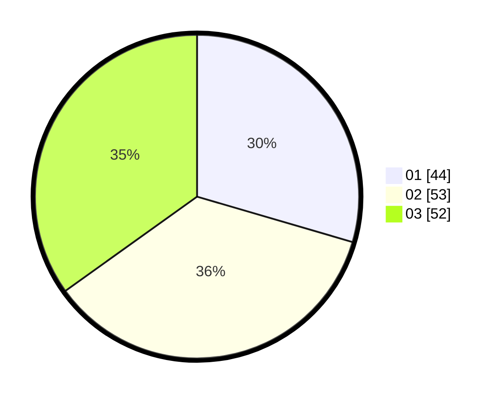

# Hasil

Hasil perolehan suara paslon dapat dilihat pada file paslon-01.txt, paslon-02.txt, dan paslon-03.txt.

Jika tidak ada, artinya data tersebut belum ada pada SIREKAP.

## Perolehan Suara

 * Paslon 01: **44**.
 * Paslon 02: **53**.
 * Paslon 03: **52**.

## Foto C Plano

https://sirekap-obj-formc.kpu.go.id/22d6/pemilu/ppwp/31/73/04/10/04/3173041004028-20240214-190750--6e4b3fb0-863b-46b5-914f-1682e2b48f53.jpg

https://sirekap-obj-formc.kpu.go.id/22d6/pemilu/ppwp/31/73/04/10/04/3173041004028-20240214-190908--c2ec3416-f648-4b00-aaf6-3cab026af754.jpg

https://sirekap-obj-formc.kpu.go.id/22d6/pemilu/ppwp/31/73/04/10/04/3173041004028-20240214-191014--90790c3d-678b-457a-8ab4-1251ca50fce8.jpg

## DATA PEMILIH TETAP

Jumlah pemilih dalam DPT: **184**.
 * L: **585**.
 * P: **99**.

## DATA PENGGUNA HAK PILIH

Jumlah pengguna hak pilih dalam DPT: **148**.
 * L: **567**.
 * P: **785**.

Jumlah pengguna hak pilih dalam DPTb: **101**.
 * L: **200**.
 * P: **1**.

Jumlah pengguna hak pilih dalam DPK: **2**.
 * L: **1**.
 * P: **1**.

Jumlah pengguna hak pilih: **151**.
 * L: **68**.
 * P: **83**.

## JUMLAH SUARA SAH DAN TIDAK SAH

JUMLAH SELURUH SUARA SAH: **149**.

JUMLAH SUARA TIDAK SAH: **2**.

JUMLAH SELURUH SUARA SAH DAN SUARA TIDAK SAH: **151**.
