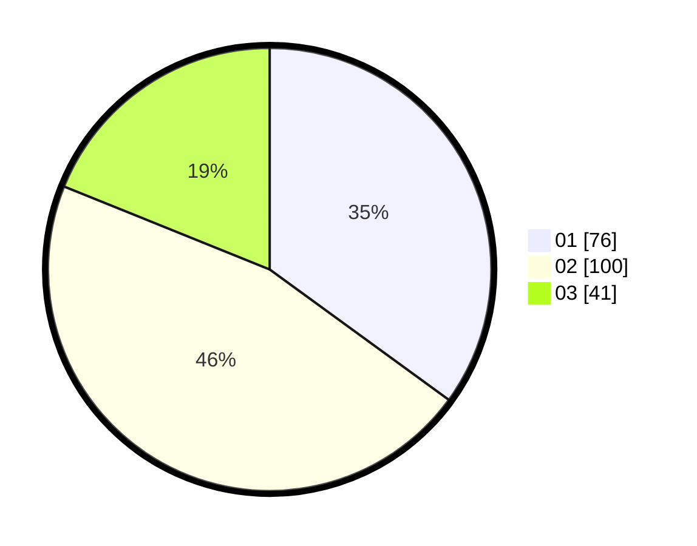

# Hasil

Hasil perolehan suara paslon dapat dilihat pada file paslon-01.txt, paslon-02.txt, dan paslon-03.txt.

Jika tidak ada, artinya data tersebut belum ada pada SIREKAP.

## Perolehan Suara

 * Paslon 01: **76**.
 * Paslon 02: **100**.
 * Paslon 03: **41**.

## Foto C Plano

https://sirekap-obj-formc.kpu.go.id/f519/pemilu/ppwp/31/73/04/10/04/3173041004032-20240214-224543--fb9bee29-180c-4b94-bbbb-39d86eca9490.jpg

https://sirekap-obj-formc.kpu.go.id/f519/pemilu/ppwp/31/73/04/10/04/3173041004032-20240214-224809--b7a8a630-35a9-452e-83de-f0d698a0ff7e.jpg

https://sirekap-obj-formc.kpu.go.id/f519/pemilu/ppwp/31/73/04/10/04/3173041004032-20240214-224959--4aa67f1e-57e0-41a6-897b-c29dd50d396d.jpg
