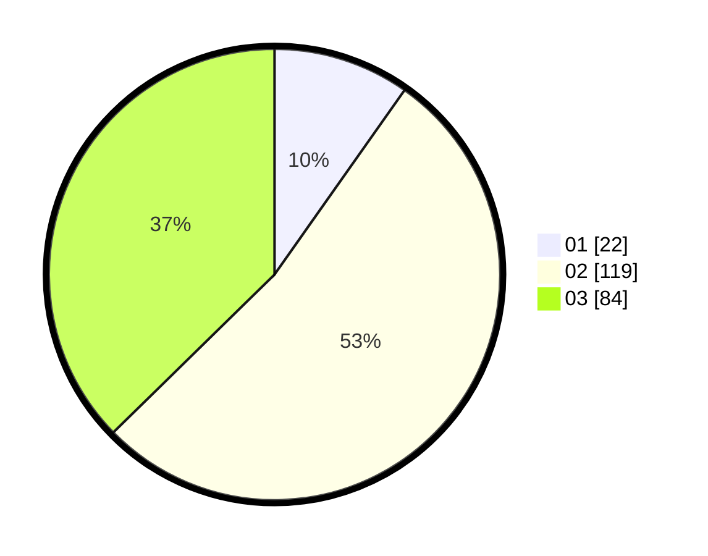

# Hasil

Hasil perolehan suara paslon dapat dilihat pada file paslon-01.txt, paslon-02.txt, dan paslon-03.txt.

Jika tidak ada, artinya data tersebut belum ada pada SIREKAP.

## Perolehan Suara

 * Paslon 01: **22**.
 * Paslon 02: **119**.
 * Paslon 03: **84**.

## Foto C Plano

https://sirekap-obj-formc.kpu.go.id/68e0/pemilu/ppwp/31/73/04/10/04/3173041004034-20240214-160153--3320ca46-46c9-4df9-88a7-c333cb0bc05b.jpg

https://sirekap-obj-formc.kpu.go.id/68e0/pemilu/ppwp/31/73/04/10/04/3173041004034-20240214-155914--01f61032-204c-4a23-80b5-27b203cecac3.jpg
