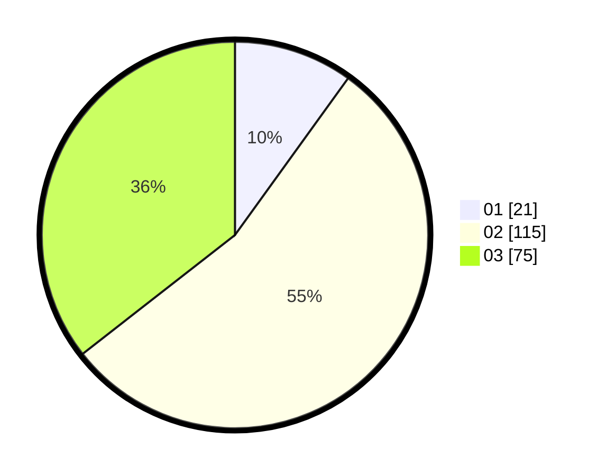

# Hasil

Hasil perolehan suara paslon dapat dilihat pada file paslon-01.txt, paslon-02.txt, dan paslon-03.txt.

Jika tidak ada, artinya data tersebut belum ada pada SIREKAP.

## Perolehan Suara

 * Paslon 01: **21**.
 * Paslon 02: **115**.
 * Paslon 03: **75**.

## Foto C Plano

https://sirekap-obj-formc.kpu.go.id/851e/pemilu/ppwp/31/73/04/10/04/3173041004036-20240214-205932--4322ed65-04cf-4d08-a1cb-3eabd014a0ca.jpg

https://sirekap-obj-formc.kpu.go.id/851e/pemilu/ppwp/31/73/04/10/04/3173041004036-20240214-210032--f0b3a75e-a3f1-44bd-8366-72feebc52755.jpg

https://sirekap-obj-formc.kpu.go.id/851e/pemilu/ppwp/31/73/04/10/04/3173041004036-20240214-210119--2eb574b5-6bee-4862-a5ef-a9bfac88cde0.jpg
