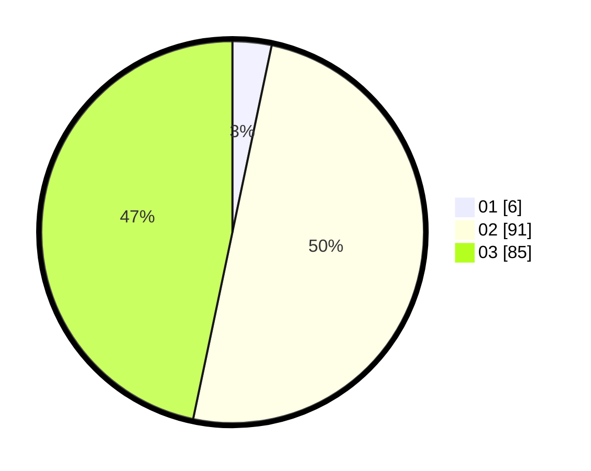

# Hasil

Hasil perolehan suara paslon dapat dilihat pada file paslon-01.txt, paslon-02.txt, dan paslon-03.txt.

Jika tidak ada, artinya data tersebut belum ada pada SIREKAP.

## Perolehan Suara

 * Paslon 01: **6**.
 * Paslon 02: **91**.
 * Paslon 03: **85**.

## Foto C Plano

https://sirekap-obj-formc.kpu.go.id/2b03/pemilu/ppwp/31/73/04/10/04/3173041004037-20240214-214552--e3b17d08-bcc2-4255-8413-d09cd8fb4a01.jpg

https://sirekap-obj-formc.kpu.go.id/2b03/pemilu/ppwp/31/73/04/10/04/3173041004037-20240214-225757--a368e138-73ac-4f85-b84f-c24a3f9f1eaa.jpg

https://sirekap-obj-formc.kpu.go.id/2b03/pemilu/ppwp/31/73/04/10/04/3173041004037-20240214-225904--3e09e784-ad5b-4d9b-b98d-ac42d7b75a50.jpg
