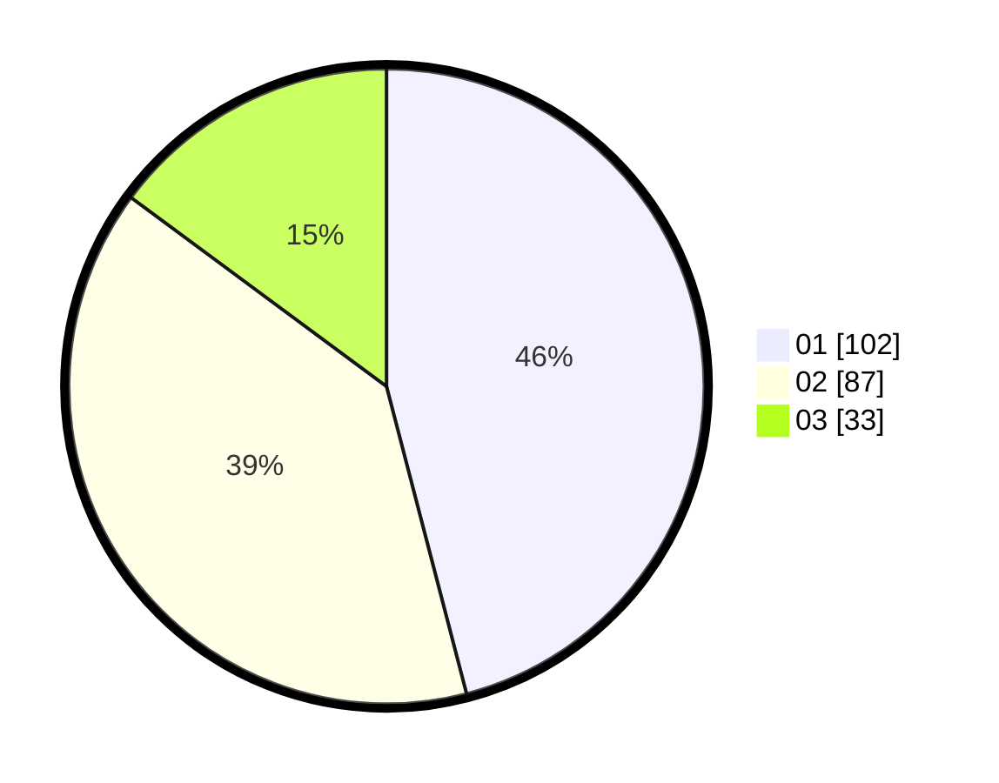

# Hasil

Hasil perolehan suara paslon dapat dilihat pada file paslon-01.txt, paslon-02.txt, dan paslon-03.txt.

Jika tidak ada, artinya data tersebut belum ada pada SIREKAP.

## Perolehan Suara

 * Paslon 01: **102**.
 * Paslon 02: **87**.
 * Paslon 03: **33**.

## Foto C Plano

https://sirekap-obj-formc.kpu.go.id/1435/pemilu/ppwp/31/73/04/10/04/3173041004041-20240214-230422--e7ca851c-4ed3-48be-aabc-ef46a25032d6.jpg

https://sirekap-obj-formc.kpu.go.id/1435/pemilu/ppwp/31/73/04/10/04/3173041004041-20240214-223757--dca93351-7c60-473c-93bd-6ff4d351df60.jpg

https://sirekap-obj-formc.kpu.go.id/1435/pemilu/ppwp/31/73/04/10/04/3173041004041-20240214-223948--0a6a26d2-357f-45e3-9edb-0f4a274ea1d1.jpg
