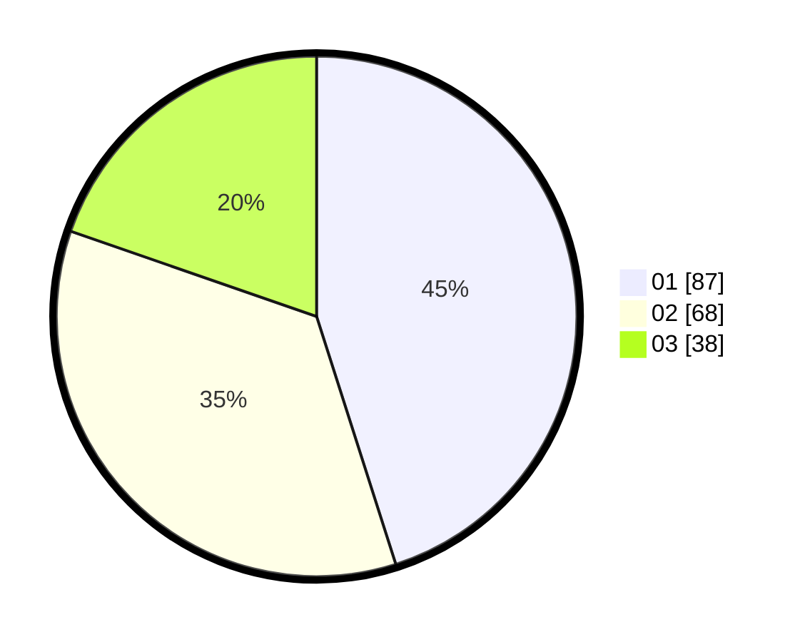

# Hasil

Hasil perolehan suara paslon dapat dilihat pada file paslon-01.txt, paslon-02.txt, dan paslon-03.txt.

Jika tidak ada, artinya data tersebut belum ada pada SIREKAP.

## Perolehan Suara

 * Paslon 01: **87**.
 * Paslon 02: **68**.
 * Paslon 03: **38**.

## Foto C Plano

https://sirekap-obj-formc.kpu.go.id/0fe5/pemilu/ppwp/31/73/04/10/04/3173041004042-20240214-225522--4849dde3-d7be-4d3f-a8f6-6390587dd93b.jpg

https://sirekap-obj-formc.kpu.go.id/0fe5/pemilu/ppwp/31/73/04/10/04/3173041004042-20240214-225544--b4bb9a66-4cc9-439d-887a-e4f19454391a.jpg
