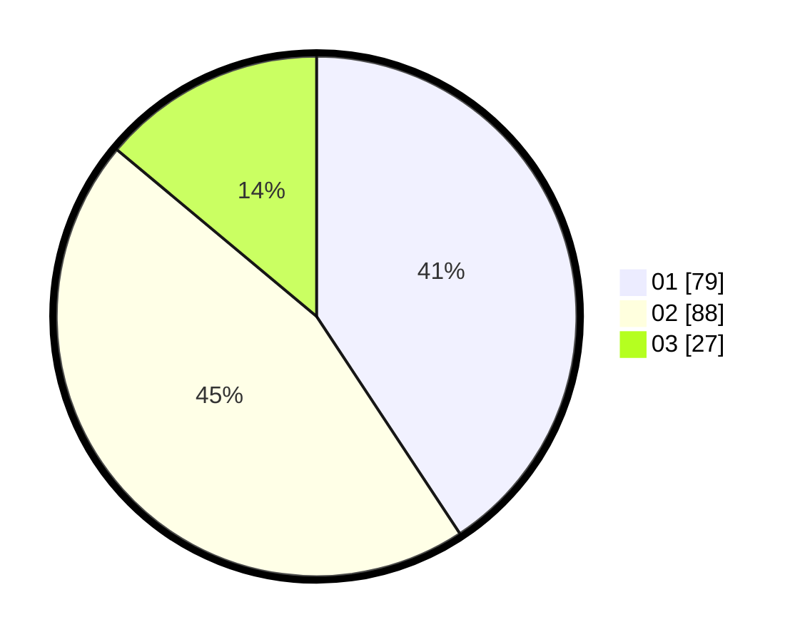

# Hasil

Hasil perolehan suara paslon dapat dilihat pada file paslon-01.txt, paslon-02.txt, dan paslon-03.txt.

Jika tidak ada, artinya data tersebut belum ada pada SIREKAP.

## Perolehan Suara

 * Paslon 01: **79**.
 * Paslon 02: **88**.
 * Paslon 03: **27**.

## Foto C Plano

https://sirekap-obj-formc.kpu.go.id/2b70/pemilu/ppwp/31/73/04/10/04/3173041004048-20240214-222218--5773d087-3224-4602-8c16-c835c890f4f1.jpg

https://sirekap-obj-formc.kpu.go.id/2b70/pemilu/ppwp/31/73/04/10/04/3173041004048-20240214-222208--df6aead4-8269-45fe-9753-3ad84111962c.jpg

https://sirekap-obj-formc.kpu.go.id/2b70/pemilu/ppwp/31/73/04/10/04/3173041004048-20240214-222229--358aaa91-8f21-4784-a49b-f5e5b3d77cfb.jpg
