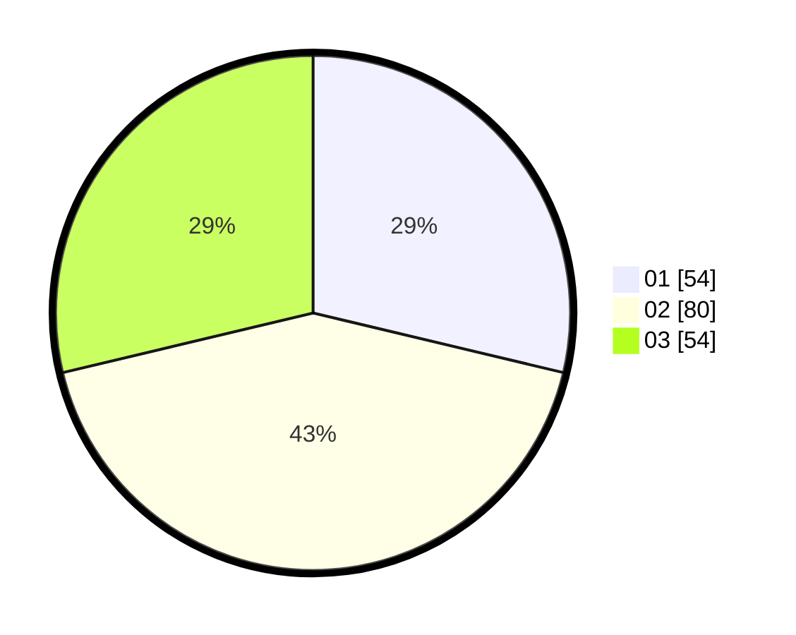

# Hasil

Hasil perolehan suara paslon dapat dilihat pada file paslon-01.txt, paslon-02.txt, dan paslon-03.txt.

Jika tidak ada, artinya data tersebut belum ada pada SIREKAP.

## Perolehan Suara

 * Paslon 01: **54**.
 * Paslon 02: **80**.
 * Paslon 03: **54**.

## Foto C Plano

https://sirekap-obj-formc.kpu.go.id/610c/pemilu/ppwp/31/73/04/10/04/3173041004051-20240214-212935--4f6aeb82-2aad-40dd-a40c-75ebdf32fa39.jpg

https://sirekap-obj-formc.kpu.go.id/610c/pemilu/ppwp/31/73/04/10/04/3173041004051-20240214-213202--b3a086d6-8d01-4ac9-8e05-a4c60ae049b1.jpg

https://sirekap-obj-formc.kpu.go.id/610c/pemilu/ppwp/31/73/04/10/04/3173041004051-20240214-213359--8774c12e-4bdf-4712-b9df-cba2f73c0d8d.jpg
