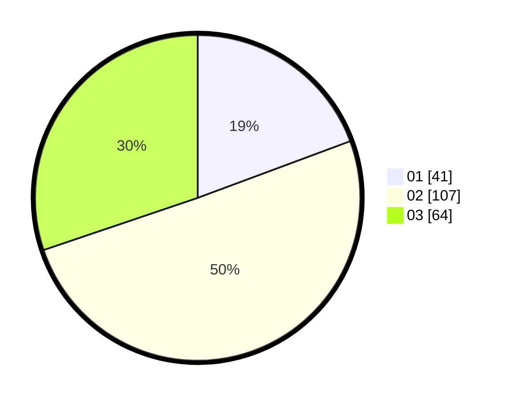

# Hasil

Hasil perolehan suara paslon dapat dilihat pada file paslon-01.txt, paslon-02.txt, dan paslon-03.txt.

Jika tidak ada, artinya data tersebut belum ada pada SIREKAP.

## Perolehan Suara

 * Paslon 01: **41**.
 * Paslon 02: **107**.
 * Paslon 03: **64**.

## Foto C Plano

https://sirekap-obj-formc.kpu.go.id/b222/pemilu/ppwp/31/73/04/10/04/3173041004052-20240214-204326--e4b9eda7-715c-443e-8aef-1aff799e882c.jpg

https://sirekap-obj-formc.kpu.go.id/b222/pemilu/ppwp/31/73/04/10/04/3173041004052-20240214-233212--b0e5e94c-f861-44da-98a8-925ea11d54da.jpg

https://sirekap-obj-formc.kpu.go.id/b222/pemilu/ppwp/31/73/04/10/04/3173041004052-20240214-204645--b82a2c63-18a8-4881-a308-105239eb1516.jpg
