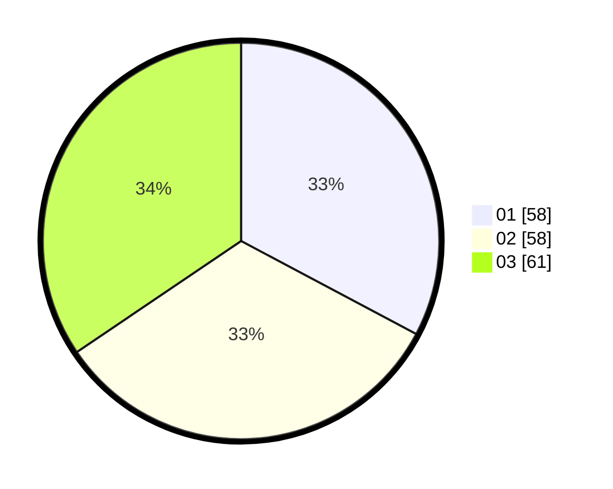

# Hasil

Hasil perolehan suara paslon dapat dilihat pada file paslon-01.txt, paslon-02.txt, dan paslon-03.txt.

Jika tidak ada, artinya data tersebut belum ada pada SIREKAP.

## Perolehan Suara

 * Paslon 01: **58**.
 * Paslon 02: **58**.
 * Paslon 03: **61**.

## Foto C Plano

https://sirekap-obj-formc.kpu.go.id/80eb/pemilu/ppwp/31/73/04/10/04/3173041004055-20240215-180612--84f27c95-80b3-4292-9283-5722f7781813.jpg

https://sirekap-obj-formc.kpu.go.id/80eb/pemilu/ppwp/31/73/04/10/04/3173041004055-20240215-180655--9f1071e0-ec93-4219-9c47-315473965a8f.jpg

https://sirekap-obj-formc.kpu.go.id/80eb/pemilu/ppwp/31/73/04/10/04/3173041004055-20240215-180758--c5dc16ce-4ea4-45b4-bf3a-5b62bdd7b5ef.jpg
