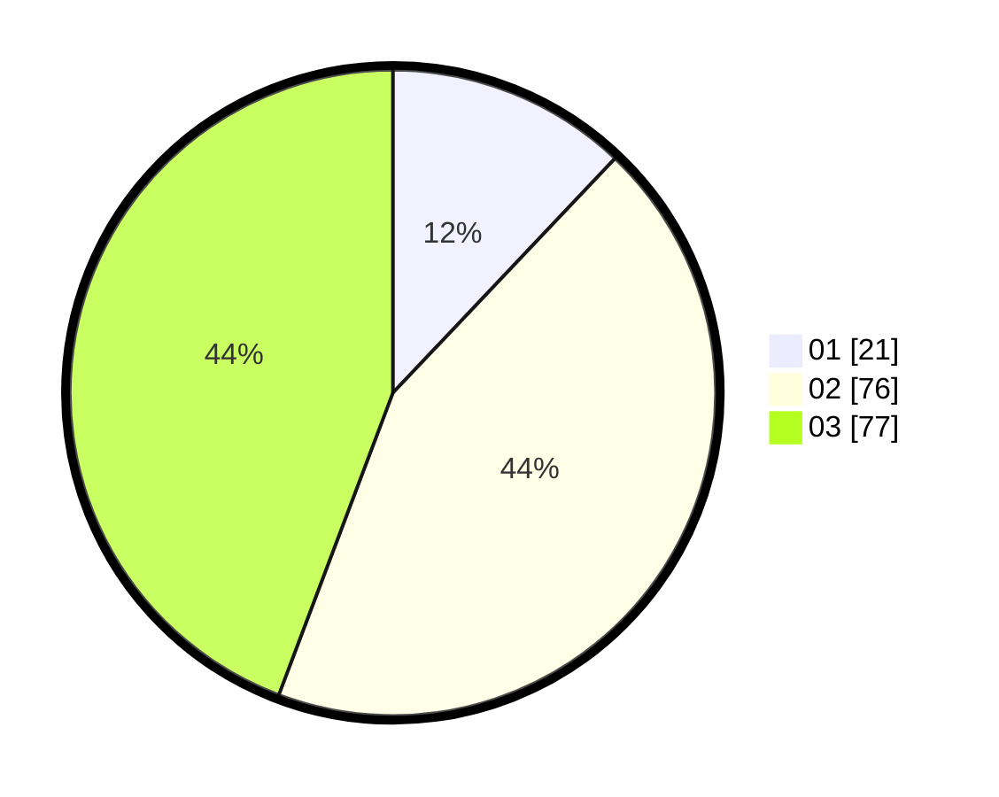

# Hasil

Hasil perolehan suara paslon dapat dilihat pada file paslon-01.txt, paslon-02.txt, dan paslon-03.txt.

Jika tidak ada, artinya data tersebut belum ada pada SIREKAP.

## Perolehan Suara

 * Paslon 01: **21**.
 * Paslon 02: **76**.
 * Paslon 03: **77**.

## Foto C Plano

https://sirekap-obj-formc.kpu.go.id/c579/pemilu/ppwp/31/73/04/10/04/3173041004058-20240214-190836--f4497be5-42e1-418c-ad2e-026dc261ad9b.jpg

https://sirekap-obj-formc.kpu.go.id/c579/pemilu/ppwp/31/73/04/10/04/3173041004058-20240214-190903--16ad3153-48ba-4a69-afcc-1748d9c25581.jpg

https://sirekap-obj-formc.kpu.go.id/c579/pemilu/ppwp/31/73/04/10/04/3173041004058-20240214-190921--27d3850a-1028-413f-a6dd-cce3ad3fe645.jpg

## DATA PEMILIH TETAP

Jumlah pemilih dalam DPT: **250**.
 * L: **115**.
 * P: **135**.

## DATA PENGGUNA HAK PILIH

Jumlah pengguna hak pilih dalam DPT: **172**.
 * L: **75**.
 * P: **97**.

Jumlah pengguna hak pilih dalam DPTb: **0**.
 * L: **0**.
 * P: **0**.

Jumlah pengguna hak pilih dalam DPK: **3**.
 * L: **2**.
 * P: **1**.

Jumlah pengguna hak pilih: **175**.
 * L: **77**.
 * P: **98**.

## JUMLAH SUARA SAH DAN TIDAK SAH

JUMLAH SELURUH SUARA SAH: **174**.

JUMLAH SUARA TIDAK SAH: **1**.

JUMLAH SELURUH SUARA SAH DAN SUARA TIDAK SAH: **175**.
