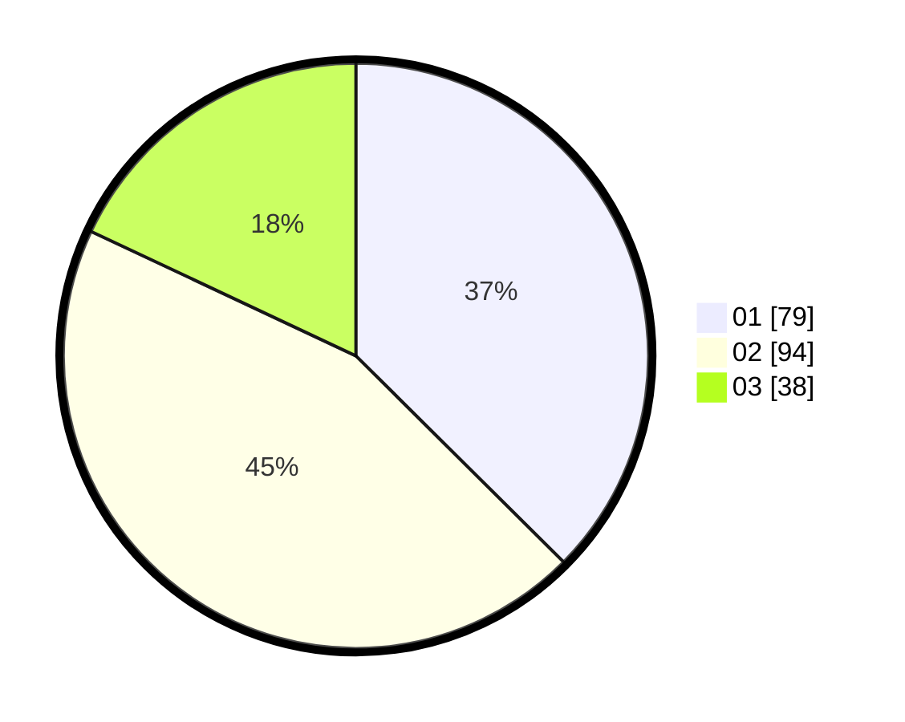

# Hasil

Hasil perolehan suara paslon dapat dilihat pada file paslon-01.txt, paslon-02.txt, dan paslon-03.txt.

Jika tidak ada, artinya data tersebut belum ada pada SIREKAP.

## Perolehan Suara

 * Paslon 01: **79**.
 * Paslon 02: **94**.
 * Paslon 03: **38**.

## Foto C Plano

https://sirekap-obj-formc.kpu.go.id/d107/pemilu/ppwp/31/73/04/10/04/3173041004060-20240215-181703--ab9937dd-4819-42a8-89f3-8d9b4b015c7e.jpg

https://sirekap-obj-formc.kpu.go.id/d107/pemilu/ppwp/31/73/04/10/04/3173041004060-20240215-181734--11f4b033-5d15-4e50-8ece-f6678a728a7a.jpg

https://sirekap-obj-formc.kpu.go.id/d107/pemilu/ppwp/31/73/04/10/04/3173041004060-20240215-181803--7ff27005-c458-41a5-84b1-92d151c4dfef.jpg
