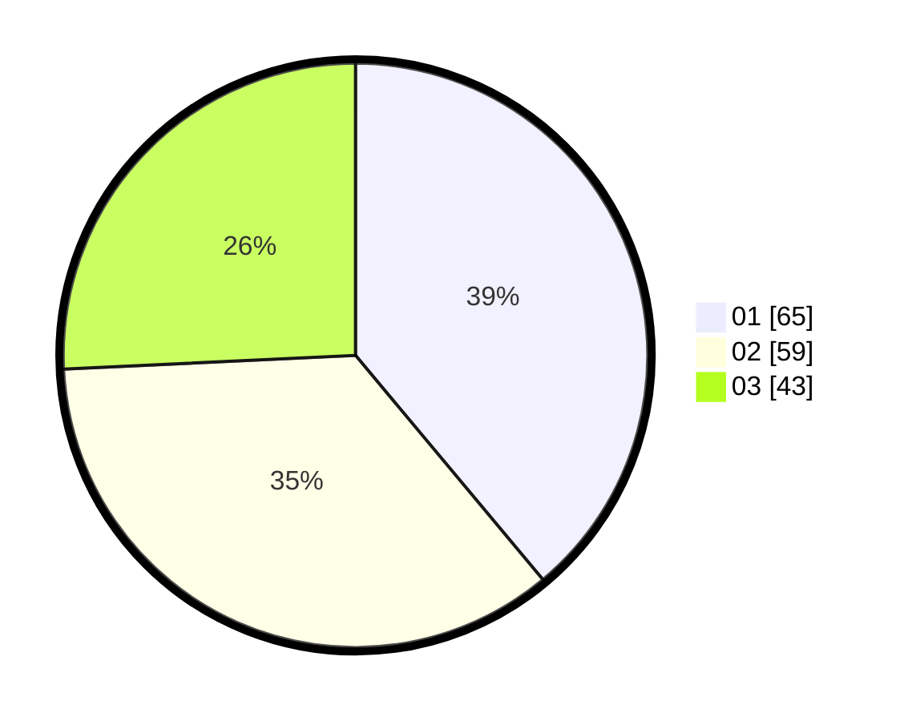

# Hasil

Hasil perolehan suara paslon dapat dilihat pada file paslon-01.txt, paslon-02.txt, dan paslon-03.txt.

Jika tidak ada, artinya data tersebut belum ada pada SIREKAP.

## Perolehan Suara

 * Paslon 01: **65**.
 * Paslon 02: **59**.
 * Paslon 03: **43**.

## Foto C Plano

https://sirekap-obj-formc.kpu.go.id/3e77/pemilu/ppwp/31/73/04/10/04/3173041004063-20240216-190414--7ad79285-7eda-4dc2-ab43-1c17f5ee64d3.jpg

https://sirekap-obj-formc.kpu.go.id/3e77/pemilu/ppwp/31/73/04/10/04/3173041004063-20240216-190415--b0acf910-9dc1-4817-a9bf-e51cfaeaffee.jpg

https://sirekap-obj-formc.kpu.go.id/3e77/pemilu/ppwp/31/73/04/10/04/3173041004063-20240216-190414--3af39d8b-7472-44e8-9f26-13b4f9043de5.jpg

## DATA PEMILIH TETAP

Jumlah pemilih dalam DPT: **224**.
 * L: **114**.
 * P: **110**.

## DATA PENGGUNA HAK PILIH

Jumlah pengguna hak pilih dalam DPT: **160**.
 * L: **81**.
 * P: **79**.

Jumlah pengguna hak pilih dalam DPTb: **8**.
 * L: **4**.
 * P: **4**.

Jumlah pengguna hak pilih dalam DPK: **0**.
 * L: **0**.
 * P: **0**.

Jumlah pengguna hak pilih: **168**.
 * L: **85**.
 * P: **83**.

## JUMLAH SUARA SAH DAN TIDAK SAH

JUMLAH SELURUH SUARA SAH: **167**.

JUMLAH SUARA TIDAK SAH: **1**.

JUMLAH SELURUH SUARA SAH DAN SUARA TIDAK SAH: **168**.
