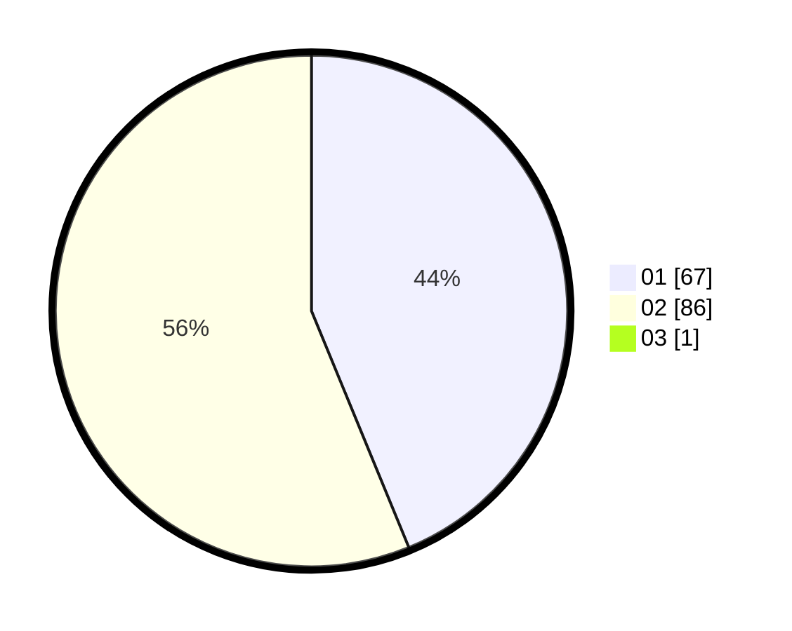

# Hasil

Hasil perolehan suara paslon dapat dilihat pada file paslon-01.txt, paslon-02.txt, dan paslon-03.txt.

Jika tidak ada, artinya data tersebut belum ada pada SIREKAP.

## Perolehan Suara

 * Paslon 01: **67**.
 * Paslon 02: **86**.
 * Paslon 03: **1**.

## Foto C Plano

https://sirekap-obj-formc.kpu.go.id/d9c0/pemilu/ppwp/31/73/04/10/04/3173041004064-20240214-232703--f72fe27e-6a11-4e0e-b0d1-11dae0ea472a.jpg

https://sirekap-obj-formc.kpu.go.id/d9c0/pemilu/ppwp/31/73/04/10/04/3173041004064-20240214-232853--7d8e16ac-7a96-4fbb-b43d-cefa7cd49709.jpg

https://sirekap-obj-formc.kpu.go.id/d9c0/pemilu/ppwp/31/73/04/10/04/3173041004064-20240214-232954--ee6c09c1-693b-49c1-b38c-476cec6a084f.jpg
