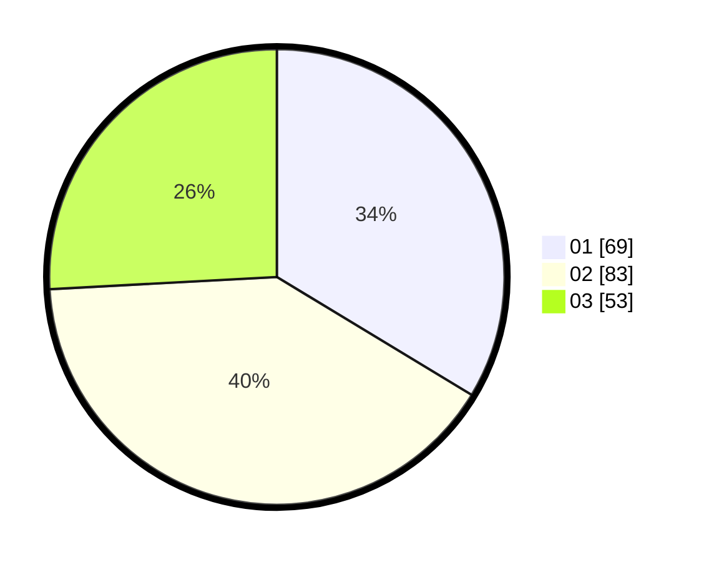

# Hasil

Hasil perolehan suara paslon dapat dilihat pada file paslon-01.txt, paslon-02.txt, dan paslon-03.txt.

Jika tidak ada, artinya data tersebut belum ada pada SIREKAP.

## Perolehan Suara

 * Paslon 01: **69**.
 * Paslon 02: **83**.
 * Paslon 03: **53**.

## Foto C Plano

https://sirekap-obj-formc.kpu.go.id/c971/pemilu/ppwp/31/73/04/10/04/3173041004065-20240214-213045--588083a3-3c65-4ce0-a1c8-15c2771bd86d.jpg

https://sirekap-obj-formc.kpu.go.id/c971/pemilu/ppwp/31/73/04/10/04/3173041004065-20240214-213200--4573da77-3670-4ed4-aeff-7097d2903555.jpg

https://sirekap-obj-formc.kpu.go.id/c971/pemilu/ppwp/31/73/04/10/04/3173041004065-20240214-213247--dcbf521e-a1de-4cc7-91ff-da6cc8427fad.jpg
