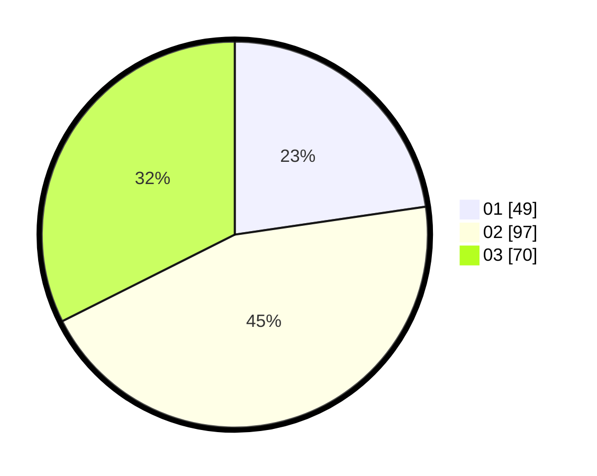

# Hasil

Hasil perolehan suara paslon dapat dilihat pada file paslon-01.txt, paslon-02.txt, dan paslon-03.txt.

Jika tidak ada, artinya data tersebut belum ada pada SIREKAP.

## Perolehan Suara

 * Paslon 01: **49**.
 * Paslon 02: **97**.
 * Paslon 03: **70**.

## Foto C Plano

https://sirekap-obj-formc.kpu.go.id/68d0/pemilu/ppwp/31/73/04/10/04/3173041004068-20240214-201309--fc74d512-b041-4e80-af65-b9138b868956.jpg

https://sirekap-obj-formc.kpu.go.id/68d0/pemilu/ppwp/31/73/04/10/04/3173041004068-20240214-201510--5066c848-3bd0-46ef-b987-ab90b300b43d.jpg

https://sirekap-obj-formc.kpu.go.id/68d0/pemilu/ppwp/31/73/04/10/04/3173041004068-20240214-201612--ad3c4e4b-d56c-43ff-8260-6e5dbc8d71d4.jpg

## DATA PEMILIH TETAP

Jumlah pemilih dalam DPT: **279**.
 * L: **127**.
 * P: **152**.

## DATA PENGGUNA HAK PILIH

Jumlah pengguna hak pilih dalam DPT: **218**.
 * L: **97**.
 * P: **121**.

Jumlah pengguna hak pilih dalam DPTb: **0**.
 * L: **0**.
 * P: **0**.

Jumlah pengguna hak pilih dalam DPK: **0**.
 * L: **0**.
 * P: **0**.

Jumlah pengguna hak pilih: **218**.
 * L: **97**.
 * P: **121**.

## JUMLAH SUARA SAH DAN TIDAK SAH

JUMLAH SELURUH SUARA SAH: **216**.

JUMLAH SUARA TIDAK SAH: **2**.

JUMLAH SELURUH SUARA SAH DAN SUARA TIDAK SAH: **218**.
