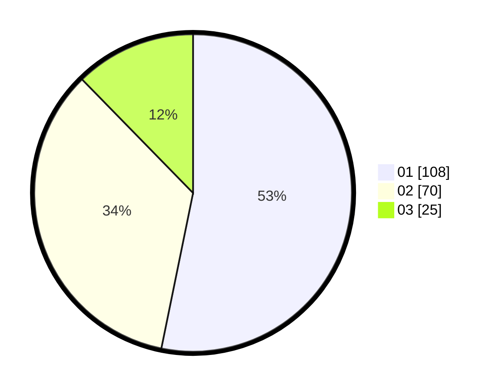

# Hasil

Hasil perolehan suara paslon dapat dilihat pada file paslon-01.txt, paslon-02.txt, dan paslon-03.txt.

Jika tidak ada, artinya data tersebut belum ada pada SIREKAP.

## Perolehan Suara

 * Paslon 01: **108**.
 * Paslon 02: **70**.
 * Paslon 03: **25**.

## Foto C Plano

https://sirekap-obj-formc.kpu.go.id/6dbf/pemilu/ppwp/31/73/04/10/04/3173041004070-20240214-220554--0cda837d-f2ab-42d3-b43c-0c12d917fde8.jpg

https://sirekap-obj-formc.kpu.go.id/6dbf/pemilu/ppwp/31/73/04/10/04/3173041004070-20240214-223304--e9128621-669a-48cb-af1b-4ca29193b0f5.jpg

https://sirekap-obj-formc.kpu.go.id/6dbf/pemilu/ppwp/31/73/04/10/04/3173041004070-20240214-223447--15522560-634a-4f8a-8271-b387a679bff7.jpg

## DATA PEMILIH TETAP

Jumlah pemilih dalam DPT: **280**.
 * L: **149**.
 * P: **131**.

## DATA PENGGUNA HAK PILIH

Jumlah pengguna hak pilih dalam DPT: **202**.
 * L: **107**.
 * P: **95**.

Jumlah pengguna hak pilih dalam DPTb: **0**.
 * L: **0**.
 * P: **0**.

Jumlah pengguna hak pilih dalam DPK: **3**.
 * L: **1**.
 * P: **2**.

Jumlah pengguna hak pilih: **205**.
 * L: **108**.
 * P: **97**.

## JUMLAH SUARA SAH DAN TIDAK SAH

JUMLAH SELURUH SUARA SAH: **203**.

JUMLAH SUARA TIDAK SAH: **2**.

JUMLAH SELURUH SUARA SAH DAN SUARA TIDAK SAH: **205**.
