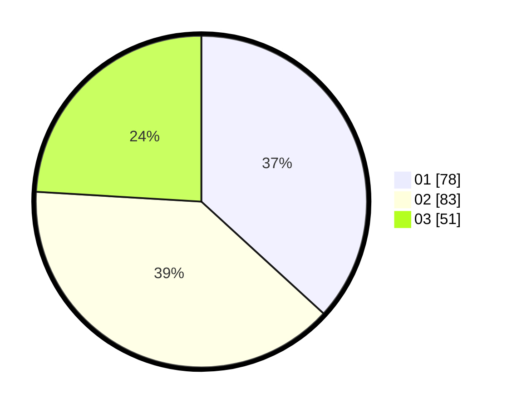

# Hasil

Hasil perolehan suara paslon dapat dilihat pada file paslon-01.txt, paslon-02.txt, dan paslon-03.txt.

Jika tidak ada, artinya data tersebut belum ada pada SIREKAP.

## Perolehan Suara

 * Paslon 01: **78**.
 * Paslon 02: **83**.
 * Paslon 03: **51**.

## Foto C Plano

https://sirekap-obj-formc.kpu.go.id/55c2/pemilu/ppwp/31/73/04/10/04/3173041004074-20240214-155911--4686c776-77c8-401f-9875-fdf0f8bb8d8f.jpg

https://sirekap-obj-formc.kpu.go.id/55c2/pemilu/ppwp/31/73/04/10/04/3173041004074-20240214-185450--c28c5a88-846f-4883-9de9-34fcd9c89869.jpg

https://sirekap-obj-formc.kpu.go.id/55c2/pemilu/ppwp/31/73/04/10/04/3173041004074-20240214-185553--b3d83aea-007f-4102-92a3-db13a491e231.jpg

## DATA PEMILIH TETAP

Jumlah pemilih dalam DPT: **284**.
 * L: **147**.
 * P: **137**.

## DATA PENGGUNA HAK PILIH

Jumlah pengguna hak pilih dalam DPT: **210**.
 * L: **106**.
 * P: **104**.

Jumlah pengguna hak pilih dalam DPTb: **3**.
 * L: **2**.
 * P: **1**.

Jumlah pengguna hak pilih dalam DPK: **0**.
 * L: **0**.
 * P: **0**.

Jumlah pengguna hak pilih: **213**.
 * L: **108**.
 * P: **105**.

## JUMLAH SUARA SAH DAN TIDAK SAH

JUMLAH SELURUH SUARA SAH: **212**.

JUMLAH SUARA TIDAK SAH: **1**.

JUMLAH SELURUH SUARA SAH DAN SUARA TIDAK SAH: **213**.
